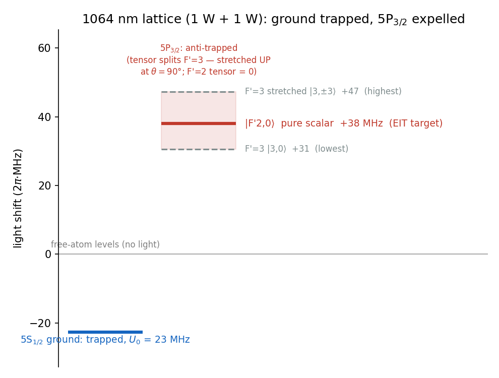
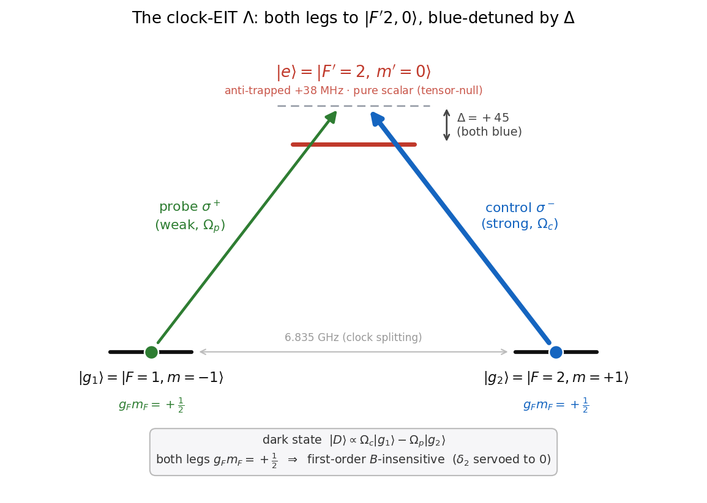

# 01 — the 3-level core

The hand-checkable heart of the scheme: a single ⁸⁷Rb atom as a clean 3-level Λ, cooled on its axial motion in the
1064 nm lattice. This chapter derives the trap, the Λ, the EIT cooling mechanism, and the (Γ/4Δ)² floor — the
supervisable core the later chapters build on. Everything here is closed form except the final number, which is one
short `qutip` solve.

## 1. The 1064 nm trap, and why the excited state is expelled

The trap at a glance (every number from [`config.py`](src/config.py) / [`stark.py`](src/stark.py)):

| parameter | value | | parameter | value |
|---|---|---|---|---|
| wavelength | 1064 nm | | trap depth U₀ | 22.7 MHz = 1.09 mK |
| power | 1 W × 2 (counter-propagating) | | axial trap freq ν_z | 2π·430 kHz |
| 1/e² waist w₀ | 19 µm | | Lamb–Dicke η | 0.094 |
| lattice spacing | 532 nm | | polarization | linear, ⊥ axial B (θ = 90°) |

Two 1064 nm beams, **1 W each, counter-propagating**, make the lattice. The AC light shift of a level of
polarizability α in intensity I is

$$U = -\frac{\alpha\,I}{2\varepsilon_0 c}\,,$$

so α > 0 is pulled **down** (trapped) and α < 0 is pushed **up**. At a lattice antinode the two fields add, so
the intensity is 4× the single-beam peak 2P/πw₀²; for 1 W and w₀ = 19 µm that is I = 7.0×10⁹ W/m².

- **Ground 5S₁/₂**, α₀ = +687 a.u. → pulled down by **U₀ ≈ 22.7 MHz = 1.09 mK**. That is the trap depth; from
  it follow ν_z = 2π·430 kHz and η = 0.094.
- **Excited 5P₃/₂**, α₀ = −1149 a.u. (Chen–Raithel, PRA 92, 060501(R), 2015) — *negative* — so it is pushed
  **up** by 22.7 × (1149/687) ≈ **+38 MHz**. The excited state is **anti-trapped** at 1064 nm.

The tensor polarizability (α₂ = +563 a.u.) splits the excited manifold by m′ — with one clean exception the
whole scheme leans on:

> The cooling transition's upper state **|F′=2, m′=0⟩ is pure scalar**: the Wigner 6j {2 2 2; 3/2 3/2 3/2} = 0
> kills the entire F′=2 hyperfine tensor. So |F′2,0⟩ sits at **+38 MHz independent of polarization geometry** —
> a fixed, calculable shift, not a sublevel that wanders with the trap. (The F′=3 levels *do* split: at the
> real **θ=90° transverse-lattice** trap the tensor pushes the **stretched |3,±3⟩ highest, to +47 MHz**, with
> |3,0⟩ lowest at +30 MHz. The sign is geometry-dependent: at θ=0, pol ∥ B — the `stark_validate.py` check
> case — the ordering inverts, stretched lowest at +19 MHz.)



*The 1064 nm light shifts, every number from [`stark.py`](src/stark.py). The ground state is pulled
into a 23 MHz (1.1 mK) well; the whole 5P₃/₂ manifold is pushed up (anti-trapped). The EIT target |F′2,0⟩ sits
at the pure-scalar +38 MHz — fixed by the 6j-null, the same in any polarization geometry.*

Run [`python src/stark.py`](src/stark.py) for every number above; [`stark_validate.py`](src/stark_validate.py)
re-derives the Wigner-6j factors from scratch and checks them. "Δ = +45 MHz" is measured from the *in-trap*
|F′2,0⟩.

## 2. The Λ scheme

A Λ on the D2 line, both legs to **one** excited state:



*Both legs are blue-detuned by Δ = +45 MHz; the two-photon detuning δ₂ = (probe − control) is servoed to the
**dark resonance** — which lies at δ₂ = 0 in this idealized 3-level Λ, but is shifted by the real manifold's light
shifts (chapter 02). Both ground states have g_F·m_F = +½, so their linear Zeeman shifts are **equal** and the
two-photon resonance is **first-order field-insensitive at any field** — the "clock" property (m_F=0 clock states,
by contrast, are insensitive only near B=0). A residual **second-order (quadratic) Zeeman** differential remains;
the δ₂ servo absorbs it, and the cooling floor itself is field-insensitive. From [`plots.py`](src/plots.py).*

## 3. How EIT cools

At two-photon resonance the atom falls into a **dark state** Ω_c|g1⟩ − Ω_p|g2⟩ that doesn't absorb. Scan the
probe and the absorption is **zero at δ₂ = 0** (the dark resonance) with a **narrow bright peak** displaced by
the control's AC-Stark shift Ω_c²/4Δ.

Add the motion: a trapped atom absorbs on sidebands at ±ν_z (red removes a phonon = cooling, blue adds one =
heating). EIT cools by lining the spectrum up so that

- the **carrier** sits on the dark resonance → no scattering, no carrier heating;
- the **cooling (red) sideband** sits on the bright peak → strong absorption;
- the **heating (blue) sideband** sits in the transparency window → suppressed.

Crucially this needs no resolved sideband (here ν_z/Γ ≈ 0.07): the *narrow EIT feature*, not the natural
linewidth, gives the selectivity. That is the whole point of EIT cooling.


*Absorption (excited population) vs the two-photon detuning δ₂. Zero at the carrier (the dark resonance), a
narrow bright peak parked on the cooling sideband at +ν_z, and the heating sideband at −ν_z left in the
transparency window. Computed by [`plots.py`](src/plots.py).*

## 4. The resonance condition, and the floor

The bright peak lands on the cooling sideband when its AC-Stark displacement equals the trap frequency:

$$\frac{\Omega_c^2}{4\Delta} = \nu_z \;\Rightarrow\; \Omega_c = \sqrt{4\,\Delta\,\nu_z} \approx 8.8 \text{ (2π·MHz)},$$

with the probe kept weak (Ω_p = 0.12 Ω_c). (More precisely it is the *total* drive Ω² = Ω_c² + Ω_p² that sets the
AC-Stark shift; with Ω_p = 0.12 Ω_c the two differ by 0.7 %, so this idealised formula keeps Ω_c for clarity while
the multilevel solver of chapter 02 pins Ω_tot exactly.) The motion then obeys a rate balance — cooling rate A₋,
heating rate A₊ — with steady state n̄_z = A₊ / (A₋ − A₊). With the cooling sideband on the bright peak, the
leftover heating is the natural-linewidth tail reaching back to the carrier, scaling as (Γ/4Δ)². So

$$\boxed{\;\bar n_{\min} \approx \left(\frac{\Gamma}{4\Delta}\right)^2 = \left(\frac{6.07}{180}\right)^2 \approx 0.0011\;}$$

— check it on a calculator. More detuning ⇒ lower floor, until photon recoil (~η² per scatter) takes over.
That one formula is the supervisable heart of the scheme.

## 5. The number ([`cooling.py`](src/cooling.py))

The exact steady state of the driven Λ dressed by the oscillator has no clean closed form, so **this is the one
place the 3-level core uses code** — a ~60-line `qutip` master equation (3 levels ⊗ oscillator), scanned over
the servo detuning δ₂:

```
numeric floor  <n_z> = 0.0020  (full recoil: both legs + emission)  at delta2 = +0.000
analytic floor (Gamma/4Delta)^2 = 0.0011  (recoil-free mechanism limit)
ground-state population P(n=0) ~ 0.998
```

The **0.0020** is the 3-level floor with the **full photon recoil** (both counter-propagating legs + spontaneous
emission) and perfect repumping; it sits above the recoil-free formula's 0.0011 by that recoil, and just below the
full multilevel solver's clean-Λ **0.0032** ([`../02_multilevel/`](../02_multilevel/)) — the remaining gap is the
full m-resolved D2 decay branching that this 3-level model, with its two-channel decay, leaves out.


*Left: starting hot (n̄₀ ≈ 2.8), the axial motion cools to the floor in ~140 µs. Right: at steady state
essentially all the population is in the motional ground state, P(n=0) ≈ 0.999. From [`plots.py`](src/plots.py).*

## Files

| file | what it does |
|---|---|
| `config.py` | every physical number (angular, 2π·MHz) |
| `stark.py` | trap depth + the 5P₃/₂ 1064 Stark shifts (closed form) |
| `stark_validate.py` | re-derives the Wigner-6j tensor factors and checks `stark.py` |
| `cooling.py` | the 3-level cooling floor (one `qutip` master equation, ~60 lines) |
| `plots.py` | the three figures (`eit_spectrum`, `cooling_curve`, `stark_manifold`, `lambda_scheme`) |

**Run** (seconds): `python src/stark.py` · `python src/stark_validate.py` · `python src/cooling.py` · `python src/plots.py`.
