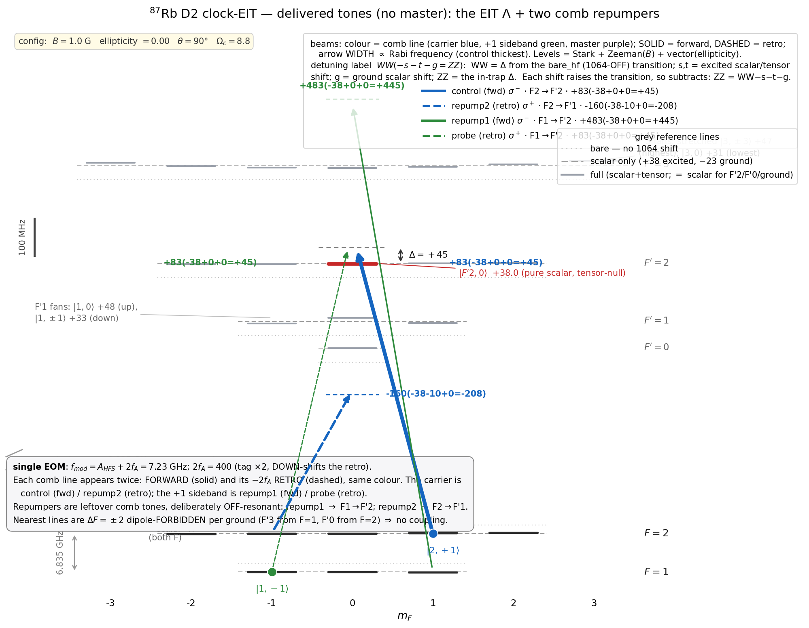

# 02 — the real ⁸⁷Rb manifold and the delivery

The baseline cooling, **without the master laser**. Chapter 01's clean 3-level Λ idealises two things; this chapter
puts them back — the full ⁸⁷Rb D2 manifold (8 ground sublevels + the 5P₃/₂ levels), real Clebsch–Gordan couplings
and photon recoil — and then delivers the tones with the real single-EOM chain (leftover comb tones as
off-resonant repumpers). Two floors come out: the intrinsic limit **0.0032**, and what the minimal chain actually
delivers, **≈ 0.09**.

## 1. The manifold, and the intrinsic limit 0.0032

It is a standard multilevel Lindblad solve; the CG / line-strength conventions are checked against the known D2
branching by [`clebsch_gordan_checks.py`](src/clebsch_gordan_checks.py), and the per-(F′,m′) 1064 Stark comes from
the same [`stark.py`](src/stark.py) as chapter 01 (the 6j / Clebsch–Gordan conventions follow Edmonds 1957). With
every m-sublevel, the full recoil, and the per-(F′,m′) 1064
Stark, the clean-Λ floor is **0.0032** — just above the 3-level's **0.0020** of chapter 01 (both carry the full
photon recoil; the difference is the full m-resolved D2 decay branching, which the 3-level's two-channel decay
leaves out). The EIT mechanism and the (Γ/4Δ)² scaling (Morigi, Eschner & Keitel 2000) are untouched.

## 2. The delivery — one seed, one EOM

The tones are made and delivered by the finalised chain

```
EBLANA (1560) → EOM → EDFA → PPLN (SHG 780) → HCPCF (trap + delivery) → AOM (tag, ×2 pass) → retro
```

a **single seed and one EOM**: f_mod = A_HFS + 2f_A = 6.83 + 0.40 = 7.23 GHz, with a 200 MHz tag AOM
double-passed to 2f_A = 400 MHz. The tag **down-shifts** the retro (retro = forward − 2f_A). This single-fibre-EOM
common-mode delivery follows the host-group HCPCF interferometer (Xin, Lan *et al.* 2018) and the no-OPLL
common-mode approach demonstrated at the 6.83 GHz clock splitting by Agnew *et al.* (2024).



*The four tones on the **1064-shifted** manifold (every level from [`stark.py`](src/stark.py) at the
real θ=90° trap; the grey dotted/dashed lines mark the bare and scalar-only positions, so the tensor shift is
visible). **|F′2,0⟩ is flat at +38 (tensor-null)** — the clean target — while **F′1 fans to +33/+48** and
**F′3 fans with the stretched |3,±3⟩ highest (+47) and |3,0⟩ lowest (+30)**. **Colour = comb line**, so the same
beam forward and retro share a colour (carrier = blue, +1 sideband = green); **solid = forward, dashed = retro**.
The Λ is control σ⁻ (forward carrier) + probe σ⁺ (retro of the +1 sideband); the repumpers are the leftover comb
tones — repump1 σ⁻ (forward +1 sideband → F1→F′2) and repump2 σ⁺ (retro carrier → F2→F′1), both off-resonant
(their closer F′3/F′0 lines are ΔF=±2 dipole-forbidden). Each beam's label is the Stark decomposition
**WW(−s−t−g=ZZ)**: WW = detuning from the bare (1064-OFF) transition; s, t = excited scalar/tensor shift;
g = ground scalar shift; ZZ = the in-trap detuning (each shift raises the transition, so subtracts). From
[`level_scheme.py`](src/level_scheme.py).*

## 3. Repumping is essential — and it is the real cost

Spontaneous decay from F′ spreads population across both ground hyperfines into sublevels the Λ never addresses;
with the repumpers off, the atom pumps **100 % dark and cooling stops**. The comb-tone repumpers — modelled as
**incoherent** off-resonant scattering (the virtual F′ adiabatically eliminated, so no rotating-frame artifact) —
do clear it, but only partly: at the chain's **natural** power the on-axis floor settles at **≈ 0.085** (Nf = 5;
≈ 0.09 Nf-converged) at the servoed δ₂-optimum — ≈ 40 % of the population still in uncooled dark sublevels. **For
this minimal chain the repumping, not the EIT mechanism, is the limit.**

*(Scope: the rate Γ(Ω/2)²/(d²+(Γ/2)²) is the low-saturation limit — reliable only for repumper power ≲ natural.
Above that it omits saturation and the a.c.-Stark shift ∝ Ω²/d, so the high-power rise in the script's sweep is
the model breaking, not physics; trust only the natural-power point.)*

**The operating point in δ₂ — it is not at zero.** In the clean 3-level Λ the dark resonance sits at δ₂ = 0
(chapter 01). In the full manifold it does not: the repumper a.c.-Stark shifts and the coherent F′1/F′3 admixtures
move the ground-state energies, dragging the dark resonance to **δ₂ ≈ −0.15** (2π·−150 kHz). The servo tracks it
there — that is the operating point at which the floor above is evaluated. The dependence is sharp:

| δ₂ (2π·MHz) | 0.00 | −0.10 | −0.15 | −0.20 | −0.30 |
|---|---|---|---|---|---|
| n̄_z | 0.25 | 0.10 | **0.085** | 0.12 | 0.59 |

At the *bare* δ₂ = 0 the floor would be ≈ 0.25, not ≈ 0.10. Because it is this steep, the floor that is actually
delivered is set by how tightly the servo holds the dark resonance — i.e. by the two-photon (Raman) coherence
linewidth (laser phase noise, servo jitter), which the numbers here idealise to zero. This is the leading
real-world limiter of the delivered floor, and the reason the "perfect servo" assumption is load-bearing.

## 4. Why the detunings are large — and why one EOM can't do better

The repumper detunings are *fixed* by f_mod and the tag shift 2f_A, and *one* AOM moves repump1 (F=1) and repump2
(F=2) in **opposite** directions, so you cannot pull both onto a useful line. Worse, every leftover tone lives near
the **cooling F′2 manifold**, and a tone close to F′2 scatters the EIT dark state — a rate estimate puts that
scatter at the cooling rate itself once a tone comes within ≈ 200 MHz of F′2. So the repumpers *must* sit ≳ 200 MHz
off F′2 — the large detunings are that protection. A configuration sweep
([`explore_configs.py`](src/explore_configs.py)) confirms the current choice is the best of the reachable comb
geometries, **capping the single-EOM chain near ~0.1**. (This cap is a rate argument plus the reachable-geometry
sweep, not a fully computed optimum: the incoherent-rate model is by construction invalid *within* ≈ 200 MHz of F′2
— where the dark-state spoiling would have to be treated coherently — so it marks that boundary rather than solving
across it.) And underneath the repumping sits a deeper limit — the **F′1 leak** ([`../03_dark_vertex/`](../03_dark_vertex/README.md)) —
whose only workaround with hardware is the optional dedicated F′1 repumper, the master laser
([`../04_master/`](../04_master/README.md)).

## Files

| file | what it does |
|---|---|
| `config.py` | every physical number (manifold + delivery: B, θ, 2f_A, …) |
| `stark.py` | the per-(F′,m′) 1064 Stark shifts (same closed form as 01; validated there) |
| `cooling_multilevel.py` | the multilevel Lindblad floor, repumpers in the computation (~1 min) |
| `clebsch_gordan_checks.py` | reconstructs known ⁸⁷Rb D2 facts from raw Clebsch–Gordan (checks the conventions) |
| `explore_configs.py` | the single-EOM / one-AOM configuration sweep (why the current placement wins) |
| `level_scheme.py` | the 24-level scheme figures on the 1064-shifted manifold — both the baseline (no master) and the master variant, written into this chapter's `images/`; colour = comb line, solid/dashed = forward/retro, each beam's label is the Stark decomposition `WW(−s−t−g=ZZ)` (bare detuning → in-trap) |

**Run:** `python src/level_scheme.py` (no solve) · `python src/cooling_multilevel.py` (~1 min) ·
`python src/clebsch_gordan_checks.py` · `python src/explore_configs.py`.

*Validity note:* the off-resonant repumpers are incoherent low-saturation rates — trust the natural-power point,
not the high-power trend (the rate omits saturation and the a.c.-Stark shift above ~natural power).

## References

Full entries and links in [`../references/`](../references/README.md).

- **Steck**, *Rubidium 87 D Line Data* — the D2 manifold constants (A_HFS, Γ, hyperfine centroids); tagged in `config.py` / `cooling_multilevel.py`.
- **Edmonds (1957)**, *Angular Momentum in Quantum Mechanics* — the Clebsch–Gordan / Wigner-6j line-strength conventions (checked in `clebsch_gordan_checks.py`).
- **Chen & Raithel (2015)**, PRA **92**, 060501(R) — the 1064 nm polarizabilities behind the per-(F′,m′) Stark shifts.
- **Morigi, Eschner & Keitel (2000)**, PRL **85**, 4458 — the EIT-cooling mechanism the multilevel solve preserves.
- **Xin, Lan *et al.* (2018)**, Sci. Adv. **4**, eaat9989 — the host-group HCPCF fibre-EOM delivery this chain inherits.
- **Agnew *et al.* (2024)**, arXiv:2404.16806 — single-EOM common-mode generation at the 6.83 GHz clock splitting (no OPLL).
- **Huang *et al.* (2021)** / **Xin *et al.* (2025)** — EIT / dark-state cooling of neutral Rb, the closest prior art for the manifold-level scheme.
