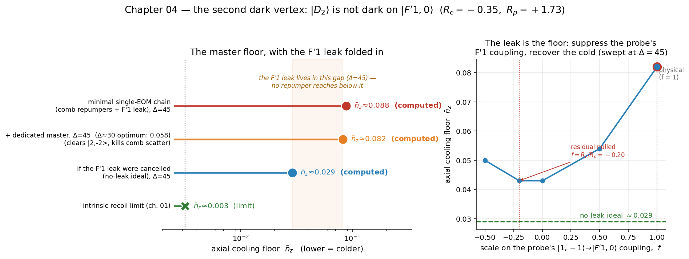

# 03 — the second dark vertex: the F′1 leak, and the best floor without the master

Chapter 02 delivered the real chain at ≈ 0.09 and called it "repump-limited." **This chapter folds in the piece of
physics underneath that number — the EIT dark state is not perfectly dark** — and asks how cold the chain gets with
**no extra hardware**. The answer: the F′1 leak sets a floor the single-EOM chain reaches at **≈ 0.087** (optimised
over Δ); going below it needs the optional master laser (chapter 04) or leak cancellation (appendix).

> This chapter is self-contained: it follows chapter 02 (the repump-limited ≈ 0.09) and motivates chapter 04
> (the master upgrade). All floors are single-atom and on-axis.

## 1. The cooling pair is two-photon resonant on F′1 as well as F′2

The dark state is built from the clock pair — control σ⁻ on |2,+1⟩, probe σ⁺ on |1,−1⟩:

```
        |D2> = (Ω_p |2,+1> − Ω_c |1,−1>) / N        (dark on |F'2,0> by construction)
```

Two-photon resonance is a property of **the two ground states and the two laser frequencies** — it
does not care which excited state sits in between. So the pair is two-photon resonant on *every* m′=0
excited state it can reach: **|F′2,0⟩** (the intended vertex) **and |F′1,0⟩**, 157 MHz below it. |D2⟩
is dark on |F′2,0⟩ and nothing more — it keeps a residual coupling onto |F′1,0⟩.

How strong is the residual? It is set by atomic structure alone. For each leg, the signed ratio of its
F′1 to its F′2 coupling (reduced matrix element × Clebsch–Gordan, the 6j sign physical) is

```
        control |2,+1> :  R_c = −0.35
        probe   |1,−1> :  R_p = +1.73      ← the probe couples 1.7× STRONGER to F'1 than to its F'2 target
```

Because **R_c ≠ R_p**, no choice of Rabi frequencies can make |D2⟩ dark on F′1 as well as F′2 — the
residual coupling Ω_res ∝ Ω_c Ω_p (R_c − R_p)/N is nonzero for any drive. |F′1,0⟩ decays **5/6 → F=1**,
so this leak is exactly what loads the F=1 dark states. The F=1 floor is *downstream* of the leak.

## 2. The floor, with and without the master (`cooling_dark_vertex.py`)

The chapter-02 solver already carries the F′1/F′3 spoiler edges coherently (its `with_e1`/`with_e3`),
at the cooling-Λ frequency, so the rotating frame still closes (conf = 0). `cooling_dark_vertex.py` scans the floor
over Δ with the leak in — and, as a *preview* of chapter 04, adds a **detuned dedicated master** (a F2→F′1 σ⁺
repumper, det ≫ 3Γ so the incoherent-rate model stays valid) to show how far the leak lets you go:

```
   minimal single-EOM chain (comb),  leak ON,  Δ = 45    n̄_z ≈ 0.088     (≈ chapter 02's 0.10)
   minimal single-EOM chain (comb),  leak OFF, Δ = 45    n̄_z ≈ 0.042
   master config (comb suppressed),  leak ON,  Δ = 45    n̄_z ≈ 0.082     (same Δ as the chain)
   master config (comb suppressed),  leak OFF, Δ = 45    n̄_z ≈ 0.029
   master config (comb suppressed),  leak ON,  Δ = 30    n̄_z ≈ 0.058     (leak-aware optimum → the headline)
```



Reading these:

- **Without the master, ≈ 0.087 is the floor.** The comb chain (first row) is repump-limited: its tones sit near
  F′2 and cannot follow the leak to small Δ, so optimising over Δ does not beat ≈ 0.087 — that is the best this
  hardware delivers. *(The master rows preview chapter 04: at a fixed Δ = 45 the master buys 0.088 → 0.082, and
  enabling the small Δ ≈ 25–30 then reaches ≈ 0.055 — whether that gain earns the extra laser is chapter 04's call.)*
- **But the floor is the leak.** At the *same* Δ = 45, turning the leak off drops the master config from
  ≈ 0.082 to ≈ 0.029 — so the **≈ 0.05 gap is the F′1 leak**, and **no repumper reaches into it**: it is
  the dark state itself scattering, not an unpumped reservoir, so the master (a different transition)
  cannot touch it.
- **Smaller Δ is colder once the leak dominates.** The leak's scatter ∝ Δ/(Δ+157)² *grows* with Δ in
  the operating range, so the leak-aware optimum is at *smaller* Δ (≈ 30, giving ≈ 0.058) — the opposite
  of the detune-harder instinct that holds when the dark state is perfect. (The numbers are ~10% Δ-/run-
  dependent; read them as "a few × 10⁻²".)

## 3. Can the leak be cancelled?

The leak is a *coherent* coupling, so in principle it can be cancelled — engineer |D2⟩ to be dark on
F′1 too. The solver tests the principle by scaling the probe's |1,−1⟩→|F′1,0⟩ edge by a factor *f*
(right panel of the figure): suppressing the dominant probe term recovers the floor from ≈ 0.08 toward
≈ 0.04, halfway to the no-leak ideal. The principle works.

The catch is hardware. **f is not a knob you have** (R_c, R_p are atomic constants); a *resonant*
canceller would put a third laser frequency on |F′1,0⟩ and break the static rotating frame; and a
co-propagating tone at the probe frequency only rescales Ω_p, not the F′1/F′2 ratio. Genuine
cancellation needs a **time-dependent (Floquet) co-propagating tone** — a different solver, and the
real frontier past the ≈ 0.06 floor.

## Files

| file | what it does |
|---|---|
| `config.py` | the knobs — reuses chapter 02's operating point verbatim (so the two stay in sync); edit the overrides block to try a chapter-03-only value |
| `cooling_dark_vertex.py` | the solver — reuses `02_multilevel/src/cooling_multilevel.py` verbatim, adds the detuned master and the cancellation knob; prints the numbers above (needs qutip) |
| `make_figure.py` | the figure (matplotlib only; plots the solver's output, regenerates without a solve) |

**Run:** `python src/cooling_dark_vertex.py` (a few minutes) · `python src/make_figure.py` (instant).

*Caveats (chapter 02's, restated): all floors are single-atom, on-axis, radially-localized best cases;
the incoherent-repumper model requires every repumper (master included) to sit ≫ 3Γ off resonance; the
Floquet cancellation of §3 is outside this static-frame solver; and ≈ 0.06 is a steady-state ground-band
number, not a measured n̄ — the experiment is the arbiter.*
