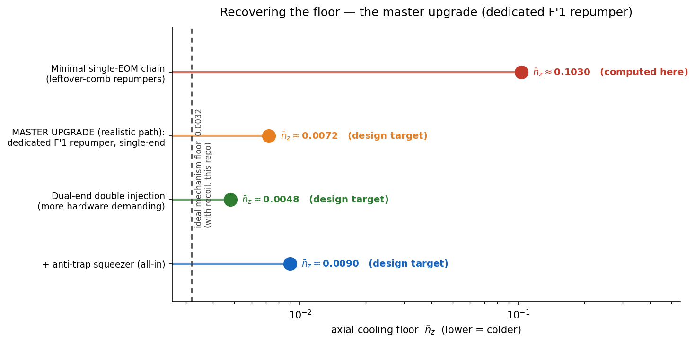
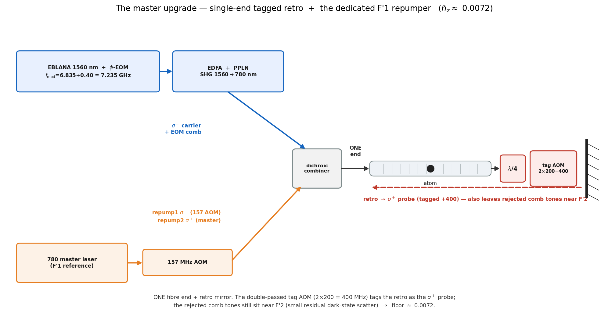

# 03 — the master laser (a dedicated F′1 repumper)

**Chapter 03 adds one piece of hardware** to the chapter-02 chain. The baseline single-EOM chain of
[`02_multilevel/`](../02_multilevel/) is **repump-limited at ~0.10** (what `cooling_multilevel.py` computes — the
physics is in §6–§7 of the [main README](../README.md)): its repumpers are leftover comb tones stuck near the
cooling F′2 manifold, and that placement caps the floor. The one fix worth building is simple:

> **Add the 780 master laser as a dedicated F′1 repumper, and keep the existing single-end delivery.**
> Nothing else changes — same fibre, same retro, same tag. This recovers the floor from ~0.10 toward the
> mechanism limit, to a **design target ≈ 0.0072**.

Everything heavier than this (dual-end re-plumbing of the fibre, etc.) buys little and costs a lot — those are
parked in [`more hardware demanding schemes/`](more%20hardware%20demanding%20schemes/README.md) as curiosities,
not as the realistic path.

> **What is computed where.** The minimal-chain **~0.10** and the intrinsic cooling limits **0.0032 / 0.0013** are
> computed in this repository. The upgrade floor **~0.0072** is a **design target** — reproducing it needs a
> dedicated-repumper (coherent F→F′1) solve, not included here. It is shown so the gain is visible, labelled as
> a target, not a result.
>
> **Where the floor lands — unresolved (two models disagree).** A coherent-solver optimization *proposes* a
> master-upgrade floor of **n̄_z ≈ 0.023**, but this repo's own engine does **not** reproduce it: at the same
> knobs it gives **~0.41** (see "Optimized master configuration" below). The ~18× gap is the **F=1 recycling**
> treatment — the coherent solver models it phenomenologically (F=1 dark ≈ 0.02), the repo uses the real
> off-resonant probe (F=1 dark ≈ 0.36). What **both** agree on is the *structure*: the master clears |2,−2⟩,
> **F=1 is the dominant residual**, and the comb byproducts hurt. The honest floor is somewhere between ~0.02 and
> ~0.4 and is **not yet pinned**; the 0.0072/0.0048 below are optimistic fuller-scheme targets, not planning numbers.

---

## Why a *dedicated* repumper helps (the one idea)

In the minimal chain the repumpers are leftover comb tones stuck near the cooling **F′2** manifold: too close to
F′2 and they scatter the EIT dark state (killing the cooling); too far and they barely repump. That tension caps
the floor at ~0.10 (≈40 % of the population stranded in dark sublevels).

A **dedicated repumper on F′1** breaks the tension. F′=1 is a *separate* hyperfine level of 5P₃/₂, **157 MHz
below F′2**. A tone resonant on F′1 repumps **resonantly** (strong) yet sits 157 MHz off the cooling F′2, so it
scatters the dark state only weakly (useful-to-harmful ratio ≈ `(157/(Γ/2))² ≈ 2700`). F′1 is also the only
excited level reachable from **both** ground hyperfines that **decays to both** (5/6 → F=1, 1/6 → F=2), so it
clears the dark sublevels and balances F=1↔F=2.

*The full delivery with the master folded in, on the 1064-shifted manifold (every level from `stark.py`). The
cooling Λ (control σ⁻ / probe σ⁺ → |F′2,0⟩) and the leftover comb repumpers, plus the **master forward σ⁺,
resonant on F′1** — whose key job is to clear **|2,−2⟩**, the *one* F=2 sublevel the σ⁻ control cannot reach
(|2,−2⟩→|F′2,−3⟩ is forbidden; with no repump, 100 % piles there and cooling stops). **|2,+2⟩ is not a
residual** — the σ⁻ control clears it (|2,+2⟩→|F′2,+1⟩, near-resonant). The master's down-shifted retro lands
400 MHz off F′1 — a **benign byproduct**. The real floor is **F=1-limited**: |1,0⟩,|1,+1⟩ accumulate, cleared
only weakly by the off-resonant probe. Colour = comb line (carrier blue, sideband green, master purple),
solid = forward, dashed = retro; each beam's label is the Stark decomposition **WW(−s−t−g=ZZ)** (bare detuning −
excited scalar − excited tensor − ground scalar = in-trap detuning). Generated by [`../02_multilevel/level_scheme.py`](../02_multilevel/level_scheme.py).*

## The build — single-end, plus the master

Keep the single-ended delivery (one fibre end + retro mirror + the double-passed tag AOM) and **add the master**
as the dedicated F′1 repumper source:

- **The critical leg, repump2 (F=2→F′1, σ⁺), is easy and lock-robust.** Take a CW slave locked to the ⁸⁷Rb
  **cooler** (F=2→F′3) and shift it down by ≈363 MHz — a standard **double-pass ~181 MHz AOM**. That offset is
  the F′3→F′1 hyperfine spacing (−424 MHz) plus the in-trap 1064 push (+61 MHz): **pure ⁸⁷Rb atomic physics**,
  so it does not depend on where the master is locked.
- It must be **F′1, not the closer F′2**: a σ⁺ tone on F′2 would drive the bright leg |2,+1⟩→|F′2,+2⟩ and spoil
  the cooling. F′1 has no m′=+2, so the bright leg is spared.
- The F=1 leg can be your **MOT repumper** (F1→F′2), routed into the fibre as-is.

**Where the floor really sits.** Once the master forward clears |2,−2⟩, all of F=2 is covered (the σ⁻ control
reaches |2,−1..+2⟩, the master forward |2,−2..0⟩). The limit is then **F=1**: |1,0⟩ and |1,+1⟩ collect
spontaneous decay and are recycled only weakly by the off-resonant probe — the intrinsic cost of cooling the
multilevel D2 line, which is why D2 EIT cooling lands near n̄_z ~ 0.1 rather than the closed-Λ ideal. A
*broadband* F=1 repumper does not help — it scatters |1,−1⟩ (the cooling leg) and light-shifts the EIT off
resonance; the practical lever is the probe strength (a modest optimum near Ω_p/Ω_c ~ 0.25). *(This corrects an
earlier note that flagged |2,+2⟩ as the residual — the control clears |2,+2⟩; the true residual is F=1.)*

---

## Optimized master configuration (proposed recipe; floor *not* corroborated here)

A coherent-solver optimization **proposes** running the master as a **weak, far-detuned "tickle"** (not an
on-resonance repumper) with the **comb byproducts suppressed**. The reasoning is sound: an on-resonance/strong
master clears |2,−2⟩ but pays a heavy **F=1 tax** (F′1 decays 5/6 → F=1, so it pumps the very F=1 dark states it
is trying to empty), so the *lightest* drive that still clears |2,−2⟩ should be best. It claims a floor
**n̄_z ≈ 0.023** (P₀ ≈ 98 %, ~30 ms⁻¹). **This repo's own model does not reproduce that number** — see below.

**Proposed operating point** (in [`../02_multilevel/config.py`](../02_multilevel/config.py) as `master_*`):
Δ = +80 (rate-driven), Ω_p/Ω_c = 0.20, master σ⁺ on F2→F′1 at ≈30 MHz red detuning, Ω_m ≈ 0.9 (the invariant is
Ω_m²/det² ≈ 9×10⁻⁴). Reproduce: `python 02_multilevel/master_optimized.py`.

**What checks out (both models agree — the robust part):**
- the master clears |2,−2⟩ (the σ⁻-control-dark state) — confirmed by selection rules;
- **F=1 (|1,0⟩, |1,+1⟩) is the dominant residual** — both models agree;
- **the comb byproducts hurt** once a dedicated master repumps: in this repo, turning them on at the proposed
  point degrades the floor **0.41 → 1.01**; the coherent solver sees 0.023 → 0.034. Either way: once you add the
  master, you want a **clean two-tone EIT delivery with the comb gone** (single-sideband/IQ modulator, or the
  probe on a separate retro path), *not* the single-EOM comb.

**What does NOT check out (the floor):** at the proposed knobs this repo's solver gives **n̄_z ≈ 0.41**
(P₀ ≈ 72 %), ~18× the claimed 0.023 — in fact *worse* than the repo's own ~0.10 baseline. Two reasons: (1) the
*detuned* incoherent master only **partially** clears |2,−2⟩ (0.16 left) at Ω_m=0.9; (2) the repo recycles F=1
with the **real off-resonant probe** (F=1 dark **0.36**), whereas the coherent solver used a **phenomenological**
F=1 repump (F=1 dark 0.02). The ~18× gap is entirely that F=1-recycling treatment. So **the headline 0.023 and
the "4× gain" are an optimistic, unconfirmed target**, not a result; the honest floor is unresolved between ~0.02
and ~0.4.

**Bottom line.** Trust the *recipe direction* (weak detuned master, comb byproducts off, Δ for rate, Ω_p/Ω_c≈0.2)
and the *structure* (master clears |2,−2⟩; F=1 limits). Do **not** quote 0.023 — pinning the real floor needs the
two solvers reconciled (chiefly: model F=1 recycling consistently). All numbers are 1D and radially-localized.

---

## More hardware-demanding alternatives (curiosities)

For completeness, [`more hardware demanding schemes/`](more%20hardware%20demanding%20schemes/README.md) records
the lower-floor-but-much-harder options (notably **dual-end double injection**, ~0.0048). They shave the floor a
little further but require re-plumbing the fibre delivery — not worth it over the master upgrade for a single
atom. They are reference curiosities, not the recommended path.

The intrinsic cooling limit all of these chase is **0.0032** (with recoil) / 0.0013 (recoil-free), both computed in this
repo. Regenerate every figure here (and the subfolder's) with `python upgrade_figures.py` (matplotlib only, no
solves).
