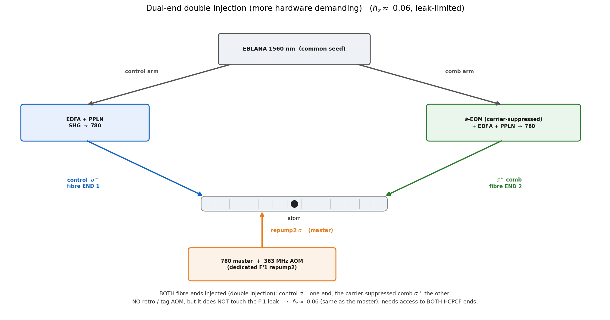

# More hardware-demanding schemes (curiosities)

These are recorded **for completeness only**. They are **curiosities, not the realistic path** — the realistic
upgrade is the master one (dedicated F′1 repumper on the existing single-end chain; see [the chapter](../README.md)).

## Dual-end double injection (curiosity)

Inject from **both** fibre ends instead of retro-reflecting from one: control σ⁻ from one end, the
carrier-suppressed EOM comb σ⁺ from the other — dropping the retro mirror and the tag AOM entirely. With the same
dedicated F′1 repumper, this removes the rejected comb tones near F′2 and the ~30 % retro-efficiency penalty.

**Why it is not the recommended path.** It needs **optical access to both ends of the HCPCF** — a much harder build
than the single-ended master — and it does **not** address the F′1 leak (which is independent of the delivery
topology), so it is **leak-limited at ≈ 0.06**, the same as the master. The cleaner delivery buys essentially
nothing over the much simpler single-ended build for a single atom.

---

*The intrinsic cooling limit the schemes chase, **0.0032**, is computed in
[`../../02_multilevel/`](../../02_multilevel/); the leak-limited ≈ 0.06 is computed in chapter 04. The figure is
regenerated by [`../upgrade_figures.py`](../upgrade_figures.py) (it writes `bench_dual_end.png` into this folder).*
