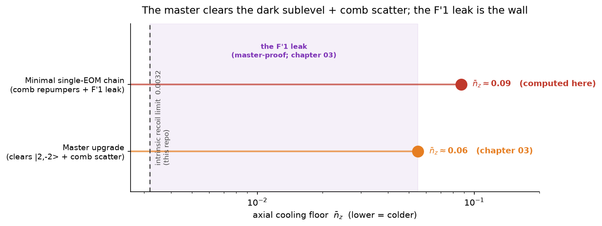
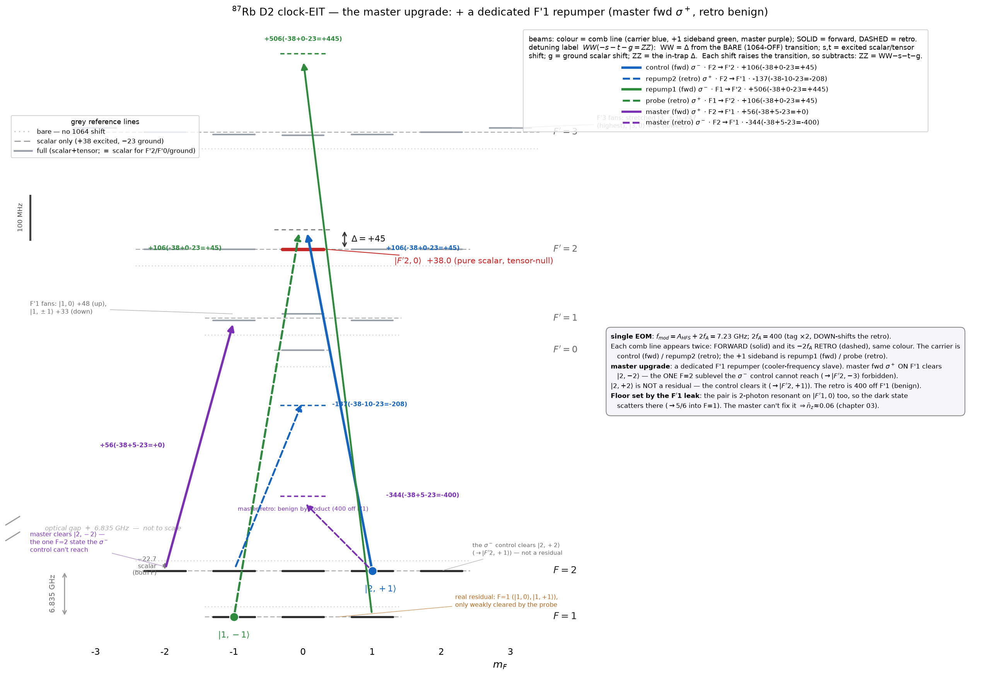
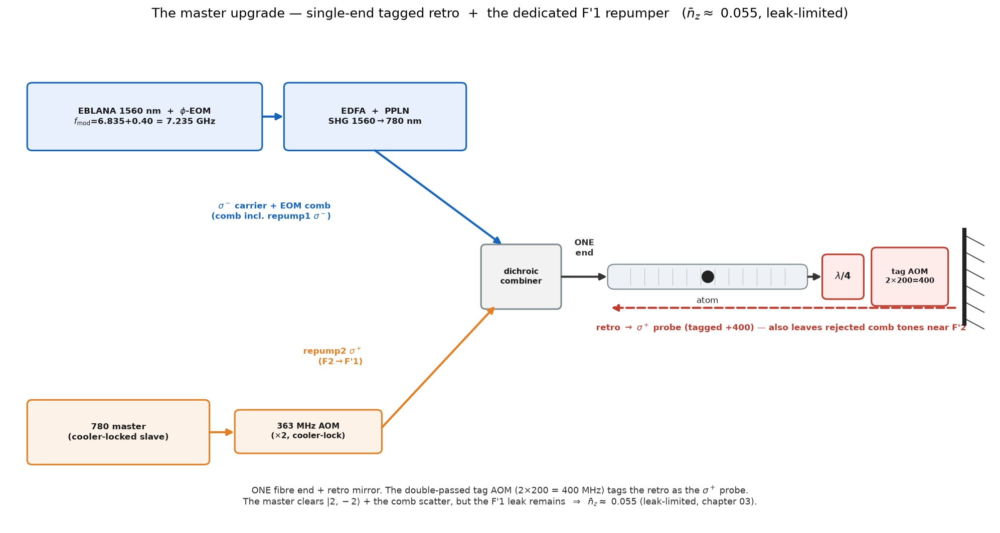

# 04 — the master laser: a possible upgrade

**Chapter 04 adds one *optional* piece of hardware.** Chapter 03 showed that, with the F′1 leak folded in, the best
the single-EOM chain reaches is **≈ 0.087** — repump-limited, because its comb tones sit near F′2 and cannot follow
the leak to small Δ (physics in §7–§8 of the [main README](../README.md)). One upgrade can break that tension:

> **Add the 780 master laser as a dedicated F′1 repumper, and keep the existing single-end delivery.**
> Nothing else changes — same fibre, same retro, same tag. It clears |2,−2⟩ and the off-resonant comb scattering,
> which lets the chain run at the leak-favoured **small Δ ≈ 25** — pulling the floor from ≈ 0.087 to **≈ 0.055**
> (leak-limited). A real but modest gain: it moves the limit from repumping to the leak, not to the 0.0032 ideal.

Everything heavier than this (dual-end re-plumbing of the fibre, etc.) buys little and costs a lot — those are
parked in [`more_hardware_demanding_schemes/`](more_hardware_demanding_schemes/README.md) as curiosities,
not as the realistic path.

> **What is computed where.** The minimal-chain **~0.09** and the intrinsic limits **0.0032 / 0.0020** are computed
> in this repository. The master floor — **≈ 0.055, leak-limited** — is **chapter 03**: it needs the F′1 leak (below)
> folded into the solve. What is solid here is the *structure*: a dedicated F′1 repumper clears |2,−2⟩ and removes
> the comb scatter (≈ 0.087 → ≈ 0.055), but the **F′1 leak** then sets the floor — and no repumper can reach it.

---

## Why a *dedicated* repumper helps (the one idea)

In the minimal chain the repumpers are leftover comb tones stuck near the cooling **F′2** manifold: too close to
F′2 and they scatter the EIT dark state (killing the cooling); too far and they barely repump. That tension caps
the floor at ≈ 0.087 (≈40 % of the population stranded in dark sublevels).

A **dedicated repumper on F′1** breaks the tension. F′=1 is a *separate* hyperfine level of 5P₃/₂, **157 MHz
below F′2**. A tone resonant on F′1 repumps **resonantly** (strong) yet sits 157 MHz off the cooling F′2, so it
scatters the dark state only weakly (useful-to-harmful ratio ≈ `(157/(Γ/2))² ≈ 2700`). F′1 is also the only
excited level reachable from **both** ground hyperfines that **decays to both** (5/6 → F=1, 1/6 → F=2), so it
clears the dark sublevels and balances F=1↔F=2.

*The full delivery with the master folded in, on the 1064-shifted manifold (every level from `stark.py`). The
cooling Λ (control σ⁻ / probe σ⁺ → |F′2,0⟩) and the leftover comb repumpers, plus the **master forward σ⁺,
resonant on F′1** — whose key job is to clear **|2,−2⟩**, the *one* F=2 sublevel the σ⁻ control cannot reach
(|2,−2⟩→|F′2,−3⟩ is forbidden; with no repump, 100 % piles there and cooling stops). **|2,+2⟩ is not a
residual** — the σ⁻ control clears it (|2,+2⟩→|F′2,+1⟩, near-resonant). The master's down-shifted retro lands
400 MHz off F′1 — a **benign byproduct**. The real floor is set by the **F′1 leak** (the dark state is two-photon
resonant on |F′1,0⟩ too → scatters → 5/6 to F=1; §7), which the master cannot fix — chapter 03 computes it (≈ 0.055).
Colour = comb line (carrier blue, sideband green, master purple),
solid = forward, dashed = retro; each beam's label is the Stark decomposition **WW(−s−t−g=ZZ)** (bare detuning −
excited scalar − excited tensor − ground scalar = in-trap detuning). Generated by [`../02_multilevel/level_scheme.py`](../02_multilevel/level_scheme.py).*

## The build — single-end, plus the master

Keep the single-ended delivery (one fibre end + retro mirror + the double-passed tag AOM) and **add the master**
as the dedicated F′1 repumper source:

- **The critical leg, repump2 (F=2→F′1, σ⁺), is easy and lock-robust.** Take a CW slave locked to the ⁸⁷Rb
  **cooler** (F=2→F′3) and shift it down by ≈363 MHz — a standard **double-pass ~181 MHz AOM**. That offset is
  the F′3→F′1 hyperfine spacing (−424 MHz) plus the in-trap 1064 push (+61 MHz): **pure ⁸⁷Rb atomic physics**,
  so it does not depend on where the master is locked.
- It must be **F′1, not the closer F′2**: a σ⁺ tone on F′2 would drive the bright leg |2,+1⟩→|F′2,+2⟩ and spoil
  the cooling. F′1 has no m′=+2, so the bright leg is spared.
- The F=1 leg can be your **MOT repumper** (F1→F′2), routed into the fibre as-is.

**Where the floor really sits.** Once the master clears |2,−2⟩ and the comb scatter is gone, the floor drops below
≈ 0.087. The limit is then the **F′1 leak**: the cooling pair is two-photon resonant on |F′1,0⟩ as well as |F′2,0⟩,
so the dark state isn't perfectly dark — it scatters into |F′1,0⟩, which decays 5/6 → F=1 and loads the F=1 dark
states. This leak is set by atomic ratios (no Rabi choice removes it), and the master — a different transition —
cannot touch it, so it caps the master at **≈ 0.055**. A *broadband* F=1 repumper does not help (it scatters the
|1,−1⟩ cooling leg and light-shifts the EIT); the leak is a *coherent* coupling, so beating it needs the dark state
engineered dark on F′1 too — **chapter 03** computes the floor and tests that cancellation.

---

## More hardware-demanding alternatives (curiosities)

For completeness, [`more_hardware_demanding_schemes/`](more_hardware_demanding_schemes/README.md) records
the heavier options (notably **dual-end double injection**). They remove the retro penalty and the rejected comb
tones, but they do **not** address the F′1 leak — which is independent of the delivery topology — so they too are
**leak-limited at ≈ 0.055**, not worth the much harder build over the single-ended master for a single atom. They
are reference curiosities, not the recommended path.

The intrinsic cooling limit all of these chase is **0.0032** (full manifold) / 0.0020 (3-level, full recoil) /
0.0011 (recoil-free mechanism), all computed in this repo; reaching it means beating the F′1 leak (chapter 03). Regenerate every figure here (and the subfolder's)
with `python upgrade_figures.py` (matplotlib only, no solves).
