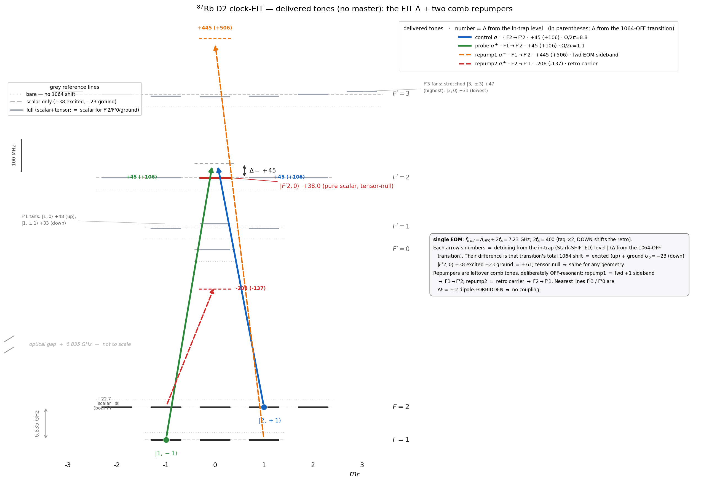
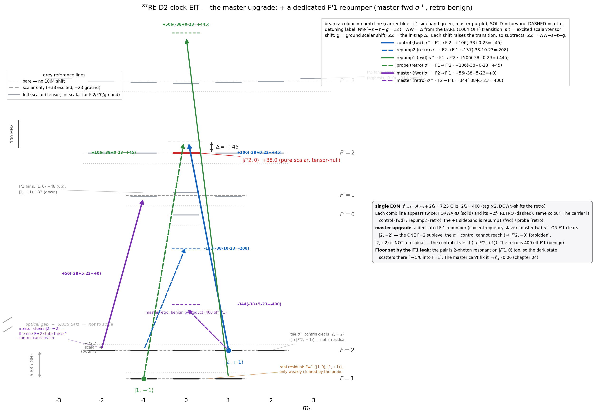
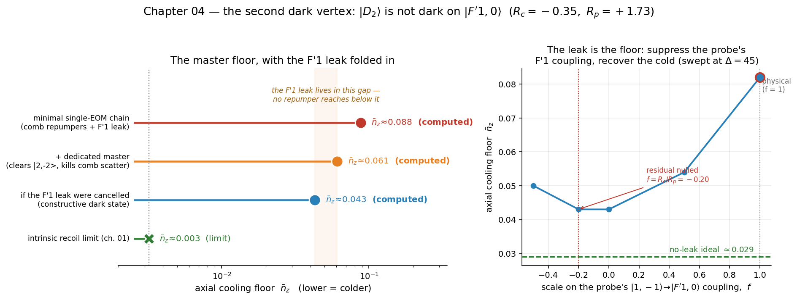

# Clock-EIT cooling of a single ⁸⁷Rb atom in a fibre trap — a numerical study

A **numerical feasibility study** — theory plus simulation, with experimentally motivated parameters (*not* an
experiment) — of EIT sideband cooling of a single ⁸⁷Rb atom on the **axial** motion of a 1064 nm optical-lattice
trap inside a hollow-core photonic-crystal fibre. The Λ legs are |F=1,m=−1⟩ σ⁺ and |F=2,m=+1⟩ σ⁻, both to
|F′=2,m′=0⟩. This is a **g_F·m_F-matched "clock" pair** (both legs have g_F·m_F = +½) — *not* the usual
m_F=0↔m_F=0 clock pair, but it serves the same purpose: a first-order magnetically insensitive two-photon
resonance (§2). **The question: how low does this model predict the axial motion cools?**

> **Status:** work in progress. The 3-level core (ch. 01) is settled and hand-checkable; the multilevel layer
> (ch. 02) is realistic but its repumper model has a stated validity limit (below); the master (ch. 03) is built —
> it lowers the floor toward the F′1-leak limit (≈ 0.06), which chapter 04 computes. Numbers are single-atom and
> on-axis — the atom cloud is not modelled here.

## The numbers, honestly

| model | floor n̄_z | what it includes | where |
|---|---|---|---|
| 3-level Λ (idealized) | **0.0013** | recoil-free lower bound; perfect repumping | [`01_three_level/`](01_three_level/) |
| multilevel, clean Λ | **0.0032** | full ⁸⁷Rb manifold **+ photon recoil** — the realistic intrinsic cooling limit | [`02_multilevel/`](02_multilevel/) |
| multilevel, real delivery | **≈ 0.10** | **+ the real off-resonant repumping** (≈ 40 % stuck in dark sublevels) | [`02_multilevel/`](02_multilevel/) |

Quote **0.0032** as the intrinsic cooling limit and **≈ 0.10** as what the minimal single-EOM chain delivers. For this
chain the **repumping**, not the EIT mechanism, sets the floor — [`03_master/`](03_master/README.md) shows how
a dedicated repumper recovers it. The 0.0013 is the idealized 3-level number: a lower bound, not a result.

All frequencies are angular, in 2π·MHz (a literal `6.07` means 2π·6.07 MHz). Every physical number lives in the
`config.py` of each folder.

## Why these choices

The three questions a reader asks first:

- **Why EIT, not resolved-sideband Raman (RSC)?** The trap is weak — ν_z/Γ ≈ 0.07, deep in the *unresolved*-sideband
  regime, where RSC fails. EIT builds its own narrow dark-resonance feature, so it cools where the bare linewidth
  cannot (§3).
- **Why the D2 line (780 nm)?** The delivery is a telecom chain seeded at 1560 nm and frequency-doubled — 1560/2 =
  780 nm lands on D2. And on D2 the target |F′2,0⟩ is **tensor-null** (§1): a light-shift-stable, geometry-independent
  upper state amid the otherwise tensor-split 5P₃/₂ manifold.
- **Why this g_F·m_F-matched pair, not m_F=0↔m_F=0?** The σ⁺/σ⁻ Λ fits the fibre geometry (axial beams, axial B);
  m_F=0 states would need π light (transverse B). And a g_F·m_F-matched pair is first-order B-insensitive at *any*
  field, whereas m_F=0 states are insensitive only near B=0 (§2).

---

## 1. The 1064 nm trap, and why the excited state is expelled

The trap at a glance (every number from [`config.py`](01_three_level/config.py) / [`stark.py`](01_three_level/stark.py)):

| parameter | value | | parameter | value |
|---|---|---|---|---|
| wavelength | 1064 nm | | trap depth U₀ | 22.7 MHz = 1.09 mK |
| power | 1 W × 2 (counter-propagating) | | axial trap freq ν_z | 2π·430 kHz |
| 1/e² waist w₀ | 19 µm | | Lamb–Dicke η | 0.094 |
| lattice spacing | 532 nm | | polarization | linear, ⊥ axial B (θ = 90°) |

The derivation, and *why* the excited state is anti-trapped:

Two 1064 nm beams, **1 W each, counter-propagating**, make the lattice. The AC light shift of a level of
polarizability α in intensity I is

$$U = -\frac{\alpha\,I}{2\varepsilon_0 c}\,,$$

so α > 0 is pulled **down** (trapped) and α < 0 is pushed **up**. At a lattice antinode the two fields add, so
the intensity is 4× the single-beam peak 2P/πw₀²; for 1 W and w₀ = 19 µm that is I = 7.0×10⁹ W/m².

- **Ground 5S₁/₂**, α₀ = +687 a.u. → pulled down by **U₀ ≈ 22.7 MHz = 1.09 mK**. That is the trap depth; from
  it follow ν_z = 2π·430 kHz and η = 0.094.
- **Excited 5P₃/₂**, α₀ = −1149 a.u. (Chen–Raithel, PRA 92, 060501(R), 2015) — *negative* — so it is pushed
  **up** by 22.7 × (1149/687) ≈ **+38 MHz**. The excited state is **anti-trapped** at 1064 nm.

The tensor polarizability (α₂ = +563 a.u.) splits the excited manifold by m′ — with one clean exception the
whole scheme leans on:

> The cooling transition's upper state **|F′=2, m′=0⟩ is pure scalar**: the Wigner 6j {2 2 2; 3/2 3/2 3/2} = 0
> kills the entire F′=2 hyperfine tensor. So |F′2,0⟩ sits at **+38 MHz independent of polarization geometry** —
> a fixed, calculable shift, not a sublevel that wanders with the trap. (The F′=3 levels *do* split: at the
> real **θ=90° transverse-lattice** trap the tensor pushes the **stretched |3,±3⟩ highest, to +47 MHz**, with
> |3,0⟩ lowest at +30 MHz. The sign is geometry-dependent: at θ=0, pol ∥ B — the `stark_validate.py` check
> case — the ordering inverts, stretched lowest at +19 MHz.)


*The 1064 nm light shifts, every number from [`stark.py`](01_three_level/stark.py). The ground state is pulled
into a 23 MHz (1.1 mK) well; the whole 5P₃/₂ manifold is pushed up (anti-trapped). The EIT target |F′2,0⟩ sits
at the pure-scalar +38 MHz — fixed by the 6j-null, the same in any polarization geometry.*

Run [`python stark.py`](01_three_level/stark.py) for every number above; [`stark_validate.py`](01_three_level/stark_validate.py)
re-derives the Wigner-6j factors from scratch and checks them. "Δ = +45 MHz" is measured from the *in-trap*
|F′2,0⟩.

---

## 2. The Λ scheme

A Λ on the D2 line, both legs to **one** excited state:


*Both legs are blue-detuned by Δ = +45 MHz; the two-photon detuning δ₂ = (probe − control) is servoed to zero.
Both ground states have g_F·m_F = +½, so their linear Zeeman shifts are **equal** and the two-photon resonance
is **first-order field-insensitive at any field** — the "clock" property (m_F=0 clock states, by contrast, are
insensitive only near B=0). A residual **second-order (quadratic) Zeeman** differential remains; the δ₂ servo
absorbs it, and the cooling floor itself is field-insensitive. From [`plots.py`](01_three_level/plots.py).*

---

## 3. How EIT cools

At two-photon resonance the atom falls into a **dark state** Ω_c|g1⟩ − Ω_p|g2⟩ that doesn't absorb. Scan the
probe and the absorption is **zero at δ₂ = 0** (the dark resonance) with a **narrow bright peak** displaced by
the control's AC-Stark shift Ω_c²/4Δ.

Add the motion: a trapped atom absorbs on sidebands at ±ν_z (red removes a phonon = cooling, blue adds one =
heating). EIT cools by lining the spectrum up so that

- the **carrier** sits on the dark resonance → no scattering, no carrier heating;
- the **cooling (red) sideband** sits on the bright peak → strong absorption;
- the **heating (blue) sideband** sits in the transparency window → suppressed.

Crucially this needs no resolved sideband (here ν_z/Γ ≈ 0.07): the *narrow EIT feature*, not the natural
linewidth, gives the selectivity. That is the whole point of EIT cooling.


*Absorption (excited population) vs the two-photon detuning δ₂. Zero at the carrier (the dark resonance), a
narrow bright peak parked on the cooling sideband at +ν_z, and the heating sideband at −ν_z left in the
transparency window. Computed by [`plots.py`](01_three_level/plots.py).*

---

## 4. The resonance condition, and the floor

The bright peak lands on the cooling sideband when its AC-Stark displacement equals the trap frequency:

$$\frac{\Omega_c^2}{4\Delta} = \nu_z \;\Rightarrow\; \Omega_c = \sqrt{4\,\Delta\,\nu_z} \approx 8.8 \text{ (2π·MHz)},$$

with the probe kept weak (Ω_p = 0.12 Ω_c). The motion then obeys a rate balance — cooling rate A₋, heating
rate A₊ — with steady state n̄_z = A₊ / (A₋ − A₊). With the cooling sideband on the bright peak, the leftover
heating is the natural-linewidth tail reaching back to the carrier, scaling as (Γ/4Δ)². So

$$\boxed{\;\bar n_{\min} \approx \left(\frac{\Gamma}{4\Delta}\right)^2 = \left(\frac{6.07}{180}\right)^2 \approx 0.0011\;}$$

— check it on a calculator. More detuning ⇒ lower floor, until photon recoil (~η² per scatter) takes over.
That one formula is the supervisable heart of the scheme.

---

## 5. The number ([`01_three_level/cooling.py`](01_three_level/cooling.py))

The exact steady state of the driven Λ dressed by the oscillator has no clean closed form, so **this is the one
place the 3-level core uses code** — a ~60-line `qutip` master equation (3 levels ⊗ oscillator), scanned over
the servo detuning δ₂:

```
numeric floor   <n_z> = 0.0013   at delta2 = +0.000 (servo point)
analytic floor  (Gamma/4Delta)^2 = 0.0011
ground-state population P(n=0) ~ 0.999
```

0.0013 sits just above the formula's 0.0011, and just below the full multilevel solver's clean-Λ **0.0032**
(§6) — the gap is the photon recoil this 3-level model leaves out.


*Left: starting hot (n̄₀ ≈ 2.8), the axial motion cools to the floor in ~140 µs. Right: at steady state
essentially all the population is in the motional ground state, P(n=0) ≈ 0.999. From
[`plots.py`](01_three_level/plots.py).*

---

## 6. The real manifold and the delivery ([`02_multilevel/cooling_multilevel.py`](02_multilevel/cooling_multilevel.py))

The clean 3-level Λ idealises two things; this layer puts them back — the full ⁸⁷Rb D2 manifold (8 ground
sublevels + the 5P₃/₂ levels), real Clebsch–Gordan couplings and photon recoil. It is a standard multilevel
Lindblad solve; the CG / line-strength conventions are checked against the known D2 branching by
[`cg_validate.py`](02_multilevel/cg_validate.py), and the per-(F′,m′) 1064 Stark comes from the same
[`stark.py`](02_multilevel/stark.py) as §1. The tones are made and delivered by the finalised chain

```
EBLANA (1560) → EOM → EDFA → PPLN (SHG 780) → HCPCF (trap + delivery) → AOM (tag, ×2 pass) → retro
```

a **single seed and one EOM**: f_mod = A_HFS + 2f_A = 6.83 + 0.40 = 7.23 GHz, with a 200 MHz tag AOM
double-passed to 2f_A = 400 MHz. The tag **down-shifts** the retro (retro = forward − 2f_A).



*The four tones on the **1064-shifted** manifold (every level from [`stark.py`](02_multilevel/stark.py) at the
real θ=90° trap; the grey dotted/dashed lines mark the bare and scalar-only positions, so the tensor shift is
visible). **|F′2,0⟩ is flat at +38 (tensor-null)** — the clean target — while **F′1 fans to +33/+48** and
**F′3 fans with the stretched |3,±3⟩ highest (+47) and |3,0⟩ lowest (+30)**. **Colour = comb line**, so the same
beam forward and retro share a colour (carrier = blue, +1 sideband = green); **solid = forward, dashed = retro**.
The Λ is control σ⁻ (forward carrier) + probe σ⁺ (retro of the +1 sideband); the repumpers are the leftover comb
tones — repump1 σ⁻ (forward +1 sideband → F1→F′2) and repump2 σ⁺ (retro carrier → F2→F′1), both off-resonant
(their closer F′3/F′0 lines are ΔF=±2 dipole-forbidden). Each beam's label is the Stark decomposition
**WW(−s−t−g=ZZ)**: WW = detuning from the bare (1064-OFF) transition; s, t = excited scalar/tensor shift;
g = ground scalar shift; ZZ = the in-trap detuning (each shift raises the transition, so subtracts). From
[`level_scheme.py`](02_multilevel/level_scheme.py).*

**(i) Manifold + recoil.** With every m-sublevel, the full recoil, and the per-(F′,m′) 1064 Stark, the clean-Λ
floor is **0.0032** — just above the recoil-light 0.0013 of §5 (the difference *is* the recoil the 3-level
model dropped). The EIT mechanism and the (Γ/4Δ)² scaling are untouched.

**(ii) Repumping is essential — and it is the real cost.** Spontaneous decay from F′ spreads population across
both ground hyperfines into sublevels the Λ never addresses; with the repumpers off, the atom pumps **100 %
dark and cooling stops**. The comb-tone repumpers — modelled as **incoherent** off-resonant scattering (the
virtual F′ adiabatically eliminated, so no rotating-frame artifact) — do clear it, but only partly: at the
chain's **natural** power the on-axis floor settles at **≈ 0.10** (≈ 40 % of the population still in uncooled
dark sublevels). **For this minimal chain the repumping, not the EIT mechanism, is the limit.**
*(Scope: the rate Γ(Ω/2)²/(d²+(Γ/2)²) is the low-saturation limit — reliable only for repumper power ≲ natural.
Above that it omits saturation and the a.c.-Stark shift ∝ Ω²/d, so the high-power rise in the script's sweep is
the model breaking, not physics; trust only the natural-power point.)*

**(iii) Why the detunings are large — and why one EOM can't do better.** The repumper detunings are *fixed* by
f_mod and the tag shift 2f_A, and *one* AOM moves repump1 (F=1) and repump2 (F=2) in **opposite** directions,
so you cannot pull both onto a useful line. Worse, every leftover tone lives near the **cooling F′2 manifold**,
and a tone close to F′2 scatters the EIT dark state at a rate that **equals the cooling rate at δ ≈ 200 MHz off
F′2**. So the repumpers *must* sit ≳ 200 MHz off F′2 — the large detunings are that protection. A configuration
sweep ([`explore_configs.py`](02_multilevel/explore_configs.py)) confirms the current choice is the best of
them, and **caps the single-EOM chain near ~0.1**. The way below it is a *separate* manifold — dedicated
repumpers **on F′1** — the subject of §7, and of chapter [`03_master/`](03_master/README.md).

---

## 7. Adding the master laser ([`03_master/`](03_master/README.md))

§6 leaves the minimal chain **repump-limited at ≈ 0.10**: its repumpers are leftover comb tones stuck near the
cooling **F′2** manifold — too close to repump strongly without scattering the dark state, too far to repump fast.
**Chapter 03 adds one piece of hardware** to break that tension: the 780 nm **master laser, run as a dedicated
repumper on F′1**. Nothing else changes — same fibre, same single-end retro, same tag.

F′=1 is a *separate* hyperfine level of 5P₃/₂, **157 MHz below F′2**. A tone resonant on F′1 repumps **resonantly**
(strong) yet sits 157 MHz off the cooling F′2, so it barely scatters the dark state. Its specific job is to clear
**|2,−2⟩** — the *one* F=2 sublevel the σ⁻ control cannot reach (|2,−2⟩→|F′2,−3⟩ is dipole-forbidden; with no
repump, population piles there and cooling stops). With |2,−2⟩ cleared, all of F=2 is covered, and the limit moves
to **F=1**: |1,0⟩ and |1,+1⟩ collect spontaneous decay and are recycled only weakly by the off-resonant probe —
the intrinsic cost of cooling the real D2 line, and why D2 EIT cooling lands near n̄_z ~ 0.1, not the closed-Λ ideal.



*The chapter-02 delivery with the master folded in, on the 1064-shifted manifold (every level from
[`stark.py`](02_multilevel/stark.py)): the cooling Λ and the leftover comb repumpers as in §6, **plus the master
forward σ⁺ resonant on F′1**, whose job is to clear |2,−2⟩ (its down-shifted retro lands 400 MHz off F′1 — a benign
byproduct). Same encoding as §6: colour = comb line (master = purple), solid = forward, dashed = retro. From
[`02_multilevel/level_scheme.py`](02_multilevel/level_scheme.py).*

**How low does it go — honestly.** The master clears |2,−2⟩ and removes the off-resonant comb-tone scattering,
pulling the floor below the minimal chain's ~0.10. But it **cannot** reach the 0.0032 mechanism limit, for a reason
the earlier sections quietly assumed away: **the EIT dark state is not perfectly dark.** The cooling pair is
two-photon resonant on **|F′1,0⟩** as well as |F′2,0⟩ (157 MHz below it), so the dark state keeps a residual
coupling onto |F′1,0⟩, which scatters and decays 5/6 → F=1. This **F′1 leak** is the dominant floor term — it is
fixed by atomic ratios (no choice of Rabi frequencies removes it), and the master, a *different* transition, does
not touch it. So the master is **leak-limited at a few ×10⁻² (≈ 0.06)** — a real gain over the minimal chain, but
well above the limit. **Chapter 04 (§8) folds the leak into the solve and computes it.** Chapter
[`03_master/`](03_master/README.md) has the build and the alternatives.

---

## 8. The second dark vertex — computing the master floor ([`04_dark_vertex/`](04_dark_vertex/README.md))

§7 left the master floor as "leak-limited, ≈ 0.06." This chapter computes it. The chapter-02 solver already
carries the F′1/F′3 spoiler edges coherently (that is *why* its headline is ~0.10, not 0.0032); adding a
*detuned* dedicated master on top — possible now that the master is far enough off resonance for the
incoherent-rate model to hold — gives the honest number:



*Left: the floor ladder. The minimal chain (≈ 0.088) and the master config (≈ 0.06) both sit above the 0.0032
limit by the **F′1 leak** — turn the leak off and the master drops to ≈ 0.029, so the ≈ 0.03 gap is the leak,
and no repumper reaches it. Right: the leak is a coherent coupling, so scaling the probe's |1,−1⟩→|F′1,0⟩ edge
down recovers the floor toward the no-leak ideal — but the scale is not a knob you have (R_c, R_p are atomic
constants). From [`04_dark_vertex/make_figure.py`](04_dark_vertex/make_figure.py).*

So the master lands at **n̄_z ≈ 0.06**, leak-limited. Two consequences: the leak's scatter ∝ Δ/(Δ+157)² *grows*
with Δ in the operating range, so the cold operating point is at **smaller Δ (≈ 30)** once the leak dominates —
the opposite of the detune-harder instinct; and the only way below ≈ 0.06 is to **cancel the leak** (engineer the
dark state dark on F′1 too), which needs a time-dependent (Floquet) tone — the frontier past this repo. Full
treatment in [`04_dark_vertex/`](04_dark_vertex/README.md).

---

## The chapters

Built up **one layer of complexity at a time** — each chapter adds a single piece of physics or hardware to the one
before, and is self-contained (its own `config.py`, runnable on its own). Read them in order.

| # | folder | what it adds | physics in | status |
|---|---|---|---|---|
| **01** | [`01_three_level/`](01_three_level/) | the idealized 3-level Λ: trap, Stark shifts, the EIT mechanism, the (Γ/4Δ)² floor | §1–§5 | **built** · n̄_z = 0.0013 |
| **02** | [`02_multilevel/`](02_multilevel/) | the real ⁸⁷Rb D2 manifold + photon recoil + the single-EOM comb delivery (probe, control, retro-reflection) | §6 | **built** · 0.0032 clean / ≈ 0.10 real |
| **03** | [`03_master/`](03_master/README.md) | the 780 master laser as a dedicated F′1 repumper | §7 | **built** · clears the dark sublevel + comb scatter (~0.10 → ≈ 0.06, leak-limited) |
| **04** | [`04_dark_vertex/`](04_dark_vertex/README.md) | the second dark vertex: the cooling pair is two-photon resonant on the F′1 m′=0 state too, so the dark state isn't perfectly dark — folds that leak in and computes the master floor | §8 | **built** · ≈ 0.06 (leak-limited) |
| 05 | *(planned)* | the anti-trapping heating from the expelled (anti-trapped) 5P₃/₂ excited state | — | planned |
| 06 | *(planned)* | the atom cloud (frozen atoms): a spread of ν_z and light shifts off-axis | — | planned |
| 07 | *(planned)* | the full semiclassical Monte-Carlo simulation | — | planned |
| 08 | *(planned)* | beam depletion along the fibre (scattering, absorption, …) | — | planned |

Chapters 05–08 are the roadmap, not yet built.

**Beyond the chapters.** [`appendix/`](appendix/README.md) is a deep-dive on the chapter-04 F′1 leak — *can it be
cancelled?* (No: a co-propagating tone can't, proven by a Floquet test; the D2 floor bottoms at ≈ 0.055.) It also
names the **D1 line** as the most promising lever to beat the leak — a future from-scratch calculation.

## How to run

```bash
pip install -r requirements.txt        # numpy, scipy, qutip, sympy, matplotlib

cd 01_three_level
python stark.py            # trap depth + the 5P3/2 Stark shifts (closed form)
python stark_validate.py   # re-derives the Wigner-6j factors and checks them
python cooling.py          # the 3-level floor  (< 10 s)
python plots.py            # the three figures (real solve, no drawn curves)

cd ../02_multilevel
python level_scheme.py        # the 24-level scheme figure (no solve)
python cooling_multilevel.py  # the realistic floor with recoil + repumping  (~1 min)
python explore_configs.py     # the single-EOM configuration sweep

cd ../03_master
python upgrade_figures.py     # the chapter-03 figures: floor ladder + benches (no solve)

cd ../04_dark_vertex
python cooling_dark_vertex.py # the master floor with the F′1 leak folded in  (~minutes; qutip)
python make_figure.py         # the chapter-04 figure (no solve)

cd ../appendix
python cancellation_floquet.py # the leak-cancellation Floquet test  (~minutes; qutip)
python make_figure.py          # the appendix figure (no solve)
```

There is no separate test runner: each script prints its own self-check, and the headline floor in §4–§5 is a
formula you can check by hand.

---

## What this model does (and does not) include

So the numbers above are read with the right scope:

- **Single atom, on axis, axial motion only** — no atom cloud, no radial motion or radial–axial coupling.
  Off-axis the atom samples a weaker 1064 intensity, and since Ω_c² ∝ I but ν_z ∝ √I the EIT condition
  Ω_c²/4Δ = ν_z drifts, walking the bright peak off the sideband — so **every number here is a radially-localized
  best case**; a radially-hot atom cools worse (the radial layer is deliberately out of this repo).
- **Anti-trapped excited state — checked, negligible.** The 5P₃/₂ is anti-trapped (+38), but its 26 ns lifetime
  is ≪ the 2.3 µs trap period, so the atom is *frozen* during the excited excursion; setting the excited
  curvature to ±ν_z moves the floor by < 2 %. The model's shared-potential approximation is therefore safe.
- **Linear polarization assumed** — the vector (circular) light shift is dropped. Along the quantization axis it
  acts like a fictitious B-field, which the g_F·m_F-matched pair cancels just like a real one (§2); the residual
  is the transverse/spatially-varying part — again a radial effect.
- **Off-resonant tones treated incoherently** (§6) — they are in fact phase-locked to the Λ; the incoherent rate
  is valid because they sit 100s of MHz off (interference suppressed), while the near-resonant master repumper
  of chapter 03 is treated coherently.
- **Lamb–Dicke regime, first order in η** (η = 0.094) — higher-order recoil terms dropped (the multilevel solver
  uses the exact displacement operator; only the 3-level `cooling.py` linearizes it, harmless at this η).
- **Perfect two-photon servo** (δ₂ held at 0) — no servo noise.
- **No technical noise** — no laser intensity/phase noise, no magnetic-field noise, no trap-frequency jitter.
- **Repumper model** (§6) is a low-saturation *incoherent* rate — trustworthy only near natural power (see the §6 scope note).
- **Detuning reference** — the per-(F′,m′) 1064 tensor Stark on F′1/F′3 *is* included (via `stark.py`); sub-MHz
  residuals in the bare-F′ hyperfine reference are not.
- **The quoted digits are computed values** at the `config.py` parameters, not a claim of physical precision to
  that many figures — read 0.0013 as ≈ 1.3×10⁻³.

**Sensitivity.** The floor scales as (Γ/4Δ)², so a ±10 % drift in Δ shifts it by ≈ ∓20 %. The cooling itself
relies on the AC-Stark condition Ω_c²/4Δ = ν_z holding, so the bright peak stays on the cooling sideband; a
few-% drift in Ω_c or Δ is tolerable, and a full Δ/Ω_c sensitivity sweep is a natural next check (not yet done).

The §1–§5 core is the supervisable heart: the EIT mechanism and the (Γ/4Δ)² floor. §6–§7 are the honest price of
the real delivery and the master repumper; the chapter map above (04–08) is what is *not* modelled yet. If any
line of physics here doesn't follow, that's a writing bug — flag it.
