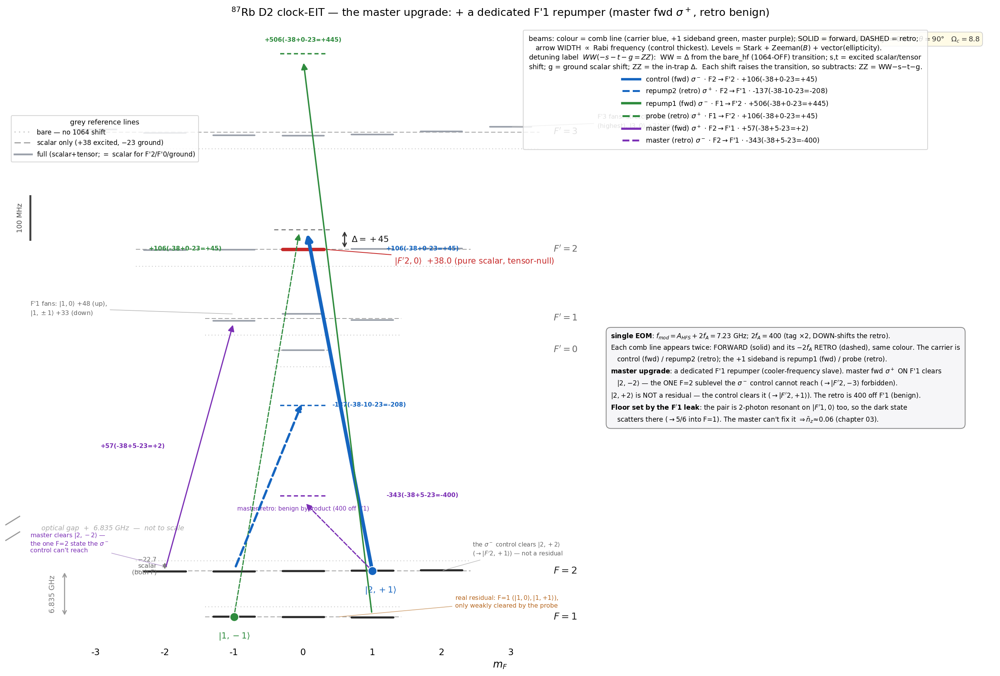

# Clock-EIT cooling of a single ⁸⁷Rb atom in a fibre trap — a numerical study

A **numerical modelling and design study** — theory plus simulation, with experimentally realistic parameters —
for a **planned** EIT sideband-cooling experiment: a single ⁸⁷Rb atom on the **axial** motion of a 1064 nm
optical-lattice trap inside a hollow-core photonic-crystal fibre. It fixes the operating point, the delivery, and
the achievable floor ahead of the build. The Λ legs are |F=1,m=−1⟩ σ⁺ and |F=2,m=+1⟩ σ⁻, both to
|F′=2,m′=0⟩. This is a **g_F·m_F-matched "clock" pair** (both legs have g_F·m_F = +½) — *not* the usual
m_F=0↔m_F=0 clock pair, but it serves the same purpose: a first-order magnetically insensitive two-photon
resonance (§2). **The question: how low does this model predict the axial motion cools?**

> **Status:** work in progress. The 3-level core (ch. 01) is settled and hand-checkable; the multilevel layer
> (ch. 02) is realistic but its repumper model has a stated validity limit (below); the **F′1 leak** (ch. 03) sets the
> real floor (best no-master ≈ 0.087), and the optional **master** (ch. 04) pushes it to ≈ 0.055 (leak-limited).
> Numbers are single-atom and on-axis — the atom cloud is not modelled here.

## The numbers, honestly

| model | floor n̄_z | what it includes | where |
|---|---|---|---|
| 3-level Λ (idealized) | **0.0020** | full recoil (both legs + emission), perfect repumping; recoil-free mechanism floor (Γ/4Δ)² = 0.0011 | [`01_three_level/`](01_three_level/) |
| multilevel, clean Λ | **0.0032** | full ⁸⁷Rb manifold **+ photon recoil** — the realistic intrinsic cooling limit | [`02_multilevel/`](02_multilevel/) |
| multilevel, real delivery | **≈ 0.09** | **+ the real off-resonant repumping**, at the servoed δ₂-optimum (≈ 40 % stuck in dark sublevels) | [`02_multilevel/`](02_multilevel/) |

Quote **0.0032** as the intrinsic cooling limit and **≈ 0.09** as what the minimal single-EOM chain delivers. For this
chain the **repumping** sets the floor; [`03_dark_vertex/`](03_dark_vertex/README.md) exposes the deeper F′1-leak
limit underneath (best no-master floor ≈ 0.087), and [`04_master/`](04_master/README.md) how far an optional master
laser pushes it (≈ 0.055, leak-limited). The 0.0020 is the idealized 3-level number (recoil-free mechanism floor
0.0011): a lower bound, not a result.

All frequencies are angular, in 2π·MHz (a literal `6.07` means 2π·6.07 MHz). Every physical number lives in the
`config.py` of each folder.

## Why these choices

The three questions a reader asks first:

- **Why EIT?** The trap is weak — ν_z/Γ ≈ 0.07, deep in the *unresolved*-sideband regime, so plain
  resolved-sideband cooling on the bare optical line is out. EIT sidesteps that: it builds its own narrow
  dark-resonance feature (its width set by the drive, not by Γ) and cools a broad range of n **continuously**,
  using the D2 beams themselves — no pulse train, no extra lasers. (Degenerate-Raman sideband cooling *also* works
  in this regime and is the nearest alternative, but it needs *separate* near-detuned Raman beams — see the
  [appendix](appendix/options.md).)
- **Why the D2 line (780 nm)?** A hardware choice: the delivery is a telecom chain seeded at 1560 nm and
  frequency-doubled (1560/2 = 780 nm = D2) — a mature, low-noise source — and on D2 the cooling target |F′2,0⟩ is
  **tensor-null** (§1), a light-shift-stable upper state. The honest trade-off: the **D1** line (795 nm) has a
  ~41× *weaker* F′1 leak and would cool *colder* ([appendix](appendix/d1_comparison.md)), but 795 nm is off the
  telecom-doubling chain. D2 is the practical line; D1 is the physically cleaner one.
- **Why this g_F·m_F-matched pair, not the m_F=0↔m_F=0 clock pair? Geometry decides it.** With B along the fibre
  axis and the beams *also* along the axis, the light is **σ-only** (a transverse wave has no π component along B),
  so the Λ must use two m_F=±1 legs — |1,−1⟩ σ⁺ and |2,+1⟩ σ⁻; a pure m_F=0 Λ would need π light (a transverse B),
  which the geometry forbids. The **bonus**: both legs share the same linear Zeeman shift (g_F·m_F = +½), so it
  cancels in the two-photon resonance — first-order field-insensitive, *like* the m_F=0 clock states, with a small
  quadratic residual the δ₂ servo absorbs (§2). Field-insensitivity is a bonus here, not the reason — the reason is
  the σ-only geometry.

---

## 1. The 1064 nm trap, and why the excited state is expelled

The trap at a glance (every number from [`config.py`](01_three_level/src/config.py) / [`stark.py`](01_three_level/src/stark.py)):

| parameter | value | | parameter | value |
|---|---|---|---|---|
| wavelength | 1064 nm | | trap depth U₀ | 22.7 MHz = 1.09 mK |
| power | 1 W × 2 (counter-propagating) | | axial trap freq ν_z | 2π·430 kHz |
| 1/e² waist w₀ | 19 µm | | Lamb–Dicke η | 0.094 |
| lattice spacing | 532 nm | | polarization | linear, ⊥ axial B (θ = 90°) |

The derivation, and *why* the excited state is anti-trapped:

Two 1064 nm beams, **1 W each, counter-propagating**, make the lattice. The AC light shift of a level of
polarizability α in intensity I is

$$U = -\frac{\alpha\,I}{2\varepsilon_0 c}\,,$$

so α > 0 is pulled **down** (trapped) and α < 0 is pushed **up**. At a lattice antinode the two fields add, so
the intensity is 4× the single-beam peak 2P/πw₀²; for 1 W and w₀ = 19 µm that is I = 7.0×10⁹ W/m².

- **Ground 5S₁/₂**, α₀ = +687 a.u. → pulled down by **U₀ ≈ 22.7 MHz = 1.09 mK**. That is the trap depth; from
  it follow ν_z = 2π·430 kHz and η = 0.094.
- **Excited 5P₃/₂**, α₀ = −1149 a.u. (Chen–Raithel, PRA 92, 060501(R), 2015) — *negative* — so it is pushed
  **up** by 22.7 × (1149/687) ≈ **+38 MHz**. The excited state is **anti-trapped** at 1064 nm.

The tensor polarizability (α₂ = +563 a.u.) splits the excited manifold by m′ — with one clean exception the
whole scheme leans on:

> The cooling transition's upper state **|F′=2, m′=0⟩ is pure scalar**: the Wigner 6j {2 2 2; 3/2 3/2 3/2} = 0
> kills the entire F′=2 hyperfine tensor. So |F′2,0⟩ sits at **+38 MHz independent of polarization geometry** —
> a fixed, calculable shift, not a sublevel that wanders with the trap. (The F′=3 levels *do* split: at the
> real **θ=90° transverse-lattice** trap the tensor pushes the **stretched |3,±3⟩ highest, to +47 MHz**, with
> |3,0⟩ lowest at +30 MHz. The sign is geometry-dependent: at θ=0, pol ∥ B — the `stark_validate.py` check
> case — the ordering inverts, stretched lowest at +19 MHz.)


*The 1064 nm light shifts, every number from [`stark.py`](01_three_level/src/stark.py). The ground state is pulled
into a 23 MHz (1.1 mK) well; the whole 5P₃/₂ manifold is pushed up (anti-trapped). The EIT target |F′2,0⟩ sits
at the pure-scalar +38 MHz — fixed by the 6j-null, the same in any polarization geometry.*

Run [`python src/stark.py`](01_three_level/src/stark.py) for every number above; [`stark_validate.py`](01_three_level/src/stark_validate.py)
re-derives the Wigner-6j factors from scratch and checks them. "Δ = +45 MHz" is measured from the *in-trap*
|F′2,0⟩.

---

## 2. The Λ scheme

A Λ on the D2 line, both legs to **one** excited state:


*Both legs are blue-detuned by Δ = +45 MHz; the two-photon detuning δ₂ = (probe − control) is servoed to the
**dark resonance** — which lies at δ₂ = 0 in this idealized 3-level Λ, but is shifted by the real manifold's light
shifts (§6). Both ground states have g_F·m_F = +½, so their linear Zeeman shifts are **equal** and the two-photon resonance
is **first-order field-insensitive at any field** — the "clock" property (m_F=0 clock states, by contrast, are
insensitive only near B=0). A residual **second-order (quadratic) Zeeman** differential remains; the δ₂ servo
absorbs it, and the cooling floor itself is field-insensitive. From [`plots.py`](01_three_level/src/plots.py).*

---

## 3. How EIT cools

At two-photon resonance the atom falls into a **dark state** Ω_c|g1⟩ − Ω_p|g2⟩ that doesn't absorb. Scan the
probe and the absorption is **zero at δ₂ = 0** (the dark resonance) with a **narrow bright peak** displaced by
the control's AC-Stark shift Ω_c²/4Δ.

Add the motion: a trapped atom absorbs on sidebands at ±ν_z (red removes a phonon = cooling, blue adds one =
heating). EIT cools by lining the spectrum up so that

- the **carrier** sits on the dark resonance → no scattering, no carrier heating;
- the **cooling (red) sideband** sits on the bright peak → strong absorption;
- the **heating (blue) sideband** sits in the transparency window → suppressed.

Crucially this needs no resolved sideband (here ν_z/Γ ≈ 0.07): the *narrow EIT feature*, not the natural
linewidth, gives the selectivity. That is the whole point of EIT cooling.


*Absorption (excited population) vs the two-photon detuning δ₂. Zero at the carrier (the dark resonance), a
narrow bright peak parked on the cooling sideband at +ν_z, and the heating sideband at −ν_z left in the
transparency window. Computed by [`plots.py`](01_three_level/src/plots.py).*

---

## 4. The resonance condition, and the floor

The bright peak lands on the cooling sideband when its AC-Stark displacement equals the trap frequency:

$$\frac{\Omega_c^2}{4\Delta} = \nu_z \;\Rightarrow\; \Omega_c = \sqrt{4\,\Delta\,\nu_z} \approx 8.8 \text{ (2π·MHz)},$$

with the probe kept weak (Ω_p = 0.12 Ω_c). (More precisely it is the *total* drive Ω² = Ω_c² + Ω_p² that sets the
AC-Stark shift; with Ω_p = 0.12 Ω_c the two differ by 0.7 %, so this idealised formula keeps Ω_c for clarity while
the multilevel solver of §6 pins Ω_tot exactly.) The motion then obeys a rate balance — cooling rate A₋, heating
rate A₊ — with steady state n̄_z = A₊ / (A₋ − A₊). With the cooling sideband on the bright peak, the leftover
heating is the natural-linewidth tail reaching back to the carrier, scaling as (Γ/4Δ)². So

$$\boxed{\;\bar n_{\min} \approx \left(\frac{\Gamma}{4\Delta}\right)^2 = \left(\frac{6.07}{180}\right)^2 \approx 0.0011\;}$$

— check it on a calculator. More detuning ⇒ lower floor, until photon recoil (~η² per scatter) takes over.
That one formula is the supervisable heart of the scheme.

---

## 5. The number ([`01_three_level/cooling.py`](01_three_level/src/cooling.py))

The exact steady state of the driven Λ dressed by the oscillator has no clean closed form, so **this is the one
place the 3-level core uses code** — a ~60-line `qutip` master equation (3 levels ⊗ oscillator), scanned over
the servo detuning δ₂:

```
numeric floor  <n_z> = 0.0020  (full recoil: both legs + emission)  at delta2 = +0.000
analytic floor (Gamma/4Delta)^2 = 0.0011  (recoil-free mechanism limit)
ground-state population P(n=0) ~ 0.998
```

0.0020 sits above the recoil-free formula's 0.0011 by the photon recoil (both counter-propagating legs +
spontaneous emission), and just below the full multilevel solver's clean-Λ **0.0032** (§6) — the remaining gap is
the full m-resolved D2 decay branching that this 3-level model, with its two-channel decay, leaves out.


*Left: starting hot (n̄₀ ≈ 2.8), the axial motion cools to the floor in ~140 µs. Right: at steady state
essentially all the population is in the motional ground state, P(n=0) ≈ 0.999. From
[`plots.py`](01_three_level/src/plots.py).*

---

## 6. The real manifold and the delivery ([`02_multilevel/cooling_multilevel.py`](02_multilevel/src/cooling_multilevel.py))

The clean 3-level Λ idealises two things; this layer puts them back — the full ⁸⁷Rb D2 manifold (8 ground
sublevels + the 5P₃/₂ levels), real Clebsch–Gordan couplings and photon recoil. It is a standard multilevel
Lindblad solve; the CG / line-strength conventions are checked against the known D2 branching by
[`clebsch_gordan_checks.py`](02_multilevel/src/clebsch_gordan_checks.py), and the per-(F′,m′) 1064 Stark comes from the same
[`stark.py`](02_multilevel/src/stark.py) as §1. The tones are made and delivered by the finalised chain

```
EBLANA (1560) → EOM → EDFA → PPLN (SHG 780) → HCPCF (trap + delivery) → AOM (tag, ×2 pass) → retro
```

a **single seed and one EOM**: f_mod = A_HFS + 2f_A = 6.83 + 0.40 = 7.23 GHz, with a 200 MHz tag AOM
double-passed to 2f_A = 400 MHz. The tag **down-shifts** the retro (retro = forward − 2f_A).


*The four tones on the **1064-shifted** manifold (every level from [`stark.py`](02_multilevel/src/stark.py) at the
real θ=90° trap; the grey dotted/dashed lines mark the bare and scalar-only positions, so the tensor shift is
visible). **|F′2,0⟩ is flat at +38 (tensor-null)** — the clean target — while **F′1 fans to +33/+48** and
**F′3 fans with the stretched |3,±3⟩ highest (+47) and |3,0⟩ lowest (+30)**. **Colour = comb line**, so the same
beam forward and retro share a colour (carrier = blue, +1 sideband = green); **solid = forward, dashed = retro**.
The Λ is control σ⁻ (forward carrier) + probe σ⁺ (retro of the +1 sideband); the repumpers are the leftover comb
tones — repump1 σ⁻ (forward +1 sideband → F1→F′2) and repump2 σ⁺ (retro carrier → F2→F′1), both off-resonant
(their closer F′3/F′0 lines are ΔF=±2 dipole-forbidden). Each beam's label is the Stark decomposition
**WW(−s−t−g=ZZ)**: WW = detuning from the bare (1064-OFF) transition; s, t = excited scalar/tensor shift;
g = ground scalar shift; ZZ = the in-trap detuning (each shift raises the transition, so subtracts). From
[`level_scheme.py`](02_multilevel/src/level_scheme.py).*

**(i) Manifold + recoil.** With every m-sublevel, the full recoil, and the per-(F′,m′) 1064 Stark, the clean-Λ
floor is **0.0032** — just above the 3-level's **0.0020** of §5 (both carry the full photon recoil; the
difference is the full m-resolved D2 decay branching, which the 3-level's two-channel decay leaves out). The EIT
mechanism and the (Γ/4Δ)² scaling are untouched.

**(ii) Repumping is essential — and it is the real cost.** Spontaneous decay from F′ spreads population across
both ground hyperfines into sublevels the Λ never addresses; with the repumpers off, the atom pumps **100 %
dark and cooling stops**. The comb-tone repumpers — modelled as **incoherent** off-resonant scattering (the
virtual F′ adiabatically eliminated, so no rotating-frame artifact) — do clear it, but only partly: at the
chain's **natural** power the on-axis floor settles at **≈ 0.085** (Nf = 5; ≈ 0.09 Nf-converged) at the servoed
δ₂-optimum — ≈ 40 % of the population still in uncooled dark sublevels. **For this minimal chain the repumping,
not the EIT mechanism, is the limit.**
*(Scope: the rate Γ(Ω/2)²/(d²+(Γ/2)²) is the low-saturation limit — reliable only for repumper power ≲ natural.
Above that it omits saturation and the a.c.-Stark shift ∝ Ω²/d, so the high-power rise in the script's sweep is
the model breaking, not physics; trust only the natural-power point.)*

**The operating point in δ₂ — it is not at zero.** In the clean 3-level Λ the dark resonance sits at δ₂ = 0 (§3).
In the full manifold it does not: the repumper a.c.-Stark shifts and the coherent F′1/F′3 admixtures move the
ground-state energies, dragging the dark resonance to **δ₂ ≈ −0.15** (2π·−150 kHz). The servo tracks it there —
that is the operating point at which the floor above is evaluated. The dependence is sharp:

| δ₂ (2π·MHz) | 0.00 | −0.10 | −0.15 | −0.20 | −0.30 |
|---|---|---|---|---|---|
| n̄_z | 0.25 | 0.10 | **0.085** | 0.12 | 0.59 |

At the *bare* δ₂ = 0 the floor would be ≈ 0.25, not ≈ 0.10. Because it is this steep, the floor that is actually
delivered is set by how tightly the servo holds the dark resonance — i.e. by the two-photon (Raman) coherence
linewidth (laser phase noise, servo jitter), which the numbers here idealise to zero. This is the leading
real-world limiter of the delivered floor, and the reason the "perfect servo" assumption below is load-bearing.

**(iii) Why the detunings are large — and why one EOM can't do better.** The repumper detunings are *fixed* by
f_mod and the tag shift 2f_A, and *one* AOM moves repump1 (F=1) and repump2 (F=2) in **opposite** directions,
so you cannot pull both onto a useful line. Worse, every leftover tone lives near the **cooling F′2 manifold**,
and a tone close to F′2 scatters the EIT dark state — a rate estimate puts that scatter at the cooling rate itself
once a tone comes within ≈ 200 MHz of F′2. So the repumpers *must* sit ≳ 200 MHz off F′2 — the large detunings are
that protection. A configuration sweep ([`explore_configs.py`](02_multilevel/src/explore_configs.py)) confirms the
current choice is the best of the reachable comb geometries, **capping the single-EOM chain near ~0.1**. (This cap
is a rate argument plus the reachable-geometry sweep, not a fully computed optimum: the incoherent-rate model is by
construction invalid *within* ≈ 200 MHz of F′2 — where the dark-state spoiling would have to be treated
coherently — so it marks that boundary rather than solving across it.) And underneath the repumping sits a deeper
limit — the **F′1 leak** (§7) — whose only workaround with hardware is the optional dedicated F′1 repumper, the master laser (§8).

---

## 7. The second dark vertex — the F′1 leak, and the best floor without the master ([`03_dark_vertex/`](03_dark_vertex/README.md))

§6 called the minimal chain "repump-limited at ≈ 0.09." Underneath the repumping sits a floor term the earlier
sections quietly assumed away: **the EIT dark state is not perfectly dark.** The cooling pair is two-photon
resonant on **|F′1,0⟩** (157 MHz below |F′2,0⟩) as well as on |F′2,0⟩ — two-photon resonance is fixed by the two
ground energies and the two laser frequencies, not by which excited state sits between. So the dark state keeps a
residual coupling onto |F′1,0⟩, which scatters and decays 5/6 → F=1. This **F′1 leak** is set by atomic ratios
alone (R_c = −0.35, R_p = +1.73; no choice of Rabi frequencies removes it) — the chapter-02 solver already carries
it coherently, which is *why* the chapter-02 headline is ~0.09, not the 0.0032 mechanism limit.


*Left: the floor ladder (at a fixed Δ = 45). The minimal chain (≈ 0.088) and, for reference, the same chain with
one extra repumper (≈ 0.082) both sit above the 0.0032 limit by the **F′1 leak** — turn the leak off and the floor
drops to ≈ 0.029, so the ≈ 0.05 that remains is the leak, and no repumper reaches it. Right: the leak is a coherent
coupling, so scaling the probe's |1,−1⟩→|F′1,0⟩ edge down would recover the floor toward the no-leak ideal — but
that scale is not a knob you have (R_c, R_p are atomic constants). From
[`03_dark_vertex/make_figure.py`](03_dark_vertex/src/make_figure.py).*

**How cold can the chain go with no extra hardware?** The leak's scatter ∝ Δ/(Δ+157)² *grows* with Δ, so — once
the leak is the limit — the cold operating point wants *smaller* Δ, the opposite of the usual detune-harder
instinct. But the minimal comb chain cannot follow it there: its repumpers are leftover comb tones stuck near F′2,
and at small Δ they scatter the dark state more, so the floor *rises* below Δ ≈ 40. Optimised over Δ (leak folded
in, chain-natural repumper power), the best the single-EOM chain reaches is **n̄_z ≈ 0.087** (near Δ = 45) —
repump-limited, and the honest answer to "how cold with the hardware already on the table." Beating it needs either
to **cancel the leak** (a time-dependent / Floquet tone — the frontier past this repo) or to remove the comb-repump
limitation so the chain *can* drop to the leak-favoured small Δ — which is the job of the optional master laser (§8).

---

## 8. The master laser — a possible upgrade ([`04_master/`](04_master/README.md))

The single-EOM chain is repump-limited at ≈ 0.087 (§7): its comb-tone repumpers sit near the cooling F′2
manifold — too close to repump hard without scattering the dark state, too far to repump fast, and unable to follow
the leak to small Δ. **One piece of extra hardware breaks that tension:** the 780 nm **master laser, run as a
dedicated repumper on F′1.** Nothing else changes — same fibre, same single-end retro, same tag. F′=1 is a
*separate* hyperfine level 157 MHz below F′2, so a tone resonant on it repumps **strongly** yet barely scatters the
dark state, and it clears **|2,−2⟩** (the one F=2 sublevel the σ⁻ control cannot reach). With the comb scatter
gone, the chain can now be run at the leak-favoured **small Δ ≈ 25**.



*The chapter-02 delivery with the master folded in, on the 1064-shifted manifold (every level from
[`stark.py`](02_multilevel/src/stark.py)): the cooling Λ and the leftover comb repumpers as in §6, **plus the master
forward σ⁺ resonant on F′1**, whose job is to clear |2,−2⟩ (its down-shifted retro lands 400 MHz off F′1 — a benign
byproduct). Colour = comb line (master = purple), solid = forward, dashed = retro. From
[`02_multilevel/level_scheme.py`](02_multilevel/src/level_scheme.py).*

**Is it a game-changer? — the honest comparison.** Each configuration optimised over Δ, with the leak folded in:

| | best floor n̄_z | at Δ | limited by |
|---|---|---|---|
| single-EOM chain (no master) | **≈ 0.087** | ~45 | repumping |
| + the master | **≈ 0.055** | ~25 | the F′1 leak |

So the master is a **real but modest** upgrade — ≈ 0.087 → ≈ 0.055 (~37 % colder) — that moves the limit from
*repumping* to the *leak*. It **cannot** approach the 0.0032 ideal: the F′1 leak, which the master (a different
transition) does not touch, caps it at a few ×10⁻². Before the leak was folded in, the master looked
transformative (a clean ~0.10 → ~0.06 heading for the ideal); with the leak in, it is a worthwhile-but-bounded
gain, and whether it earns the extra 780 nm laser is a genuine call. The build, the alternatives, and the
leak-cancellation frontier are in [`04_master/`](04_master/README.md) and [`appendix/`](appendix/README.md).

---

## The chapters

Built up **one layer of complexity at a time** — each chapter adds a single piece of physics or hardware to the one
before, and is self-contained (its own `config.py`, runnable on its own). Read them in order.

| # | folder | what it adds | physics in | status |
|---|---|---|---|---|
| **01** | [`01_three_level/`](01_three_level/) | the idealized 3-level Λ: trap, Stark shifts, the EIT mechanism, the (Γ/4Δ)² floor | §1–§5 | **built** · n̄_z = 0.0020 |
| **02** | [`02_multilevel/`](02_multilevel/) | the real ⁸⁷Rb D2 manifold + photon recoil + the single-EOM comb delivery (probe, control, retro-reflection) | §6 | **built** · 0.0032 clean / ≈ 0.09 real |
| **03** | [`03_dark_vertex/`](03_dark_vertex/README.md) | the second dark vertex: the cooling pair is two-photon resonant on the F′1 m′=0 state too, so the dark state isn't perfectly dark — folds that leak in and finds the best floor **without** the master | §7 | **built** · ≈ 0.087 (no-master, repump-limited) |
| **04** | [`04_master/`](04_master/README.md) | the 780 master laser as a dedicated F′1 repumper — a possible upgrade; does it earn the extra hardware? | §8 | **built** · ≈ 0.055 (leak-limited) |
| 05 | *(planned)* | the anti-trapping heating from the expelled 5P₃/₂ excited state, computed explicitly (estimated < 2 % in the scope notes) | — | planned |
| 06 | *(planned)* | the atom cloud (frozen atoms): a spread of ν_z and light shifts off-axis | — | planned |
| 07 | *(planned)* | the full semiclassical Monte-Carlo simulation | — | planned |
| 08 | *(planned)* | beam depletion along the fibre (scattering, absorption, …) | — | planned |

Chapters 05–08 are the roadmap, not yet built.

**Beyond the chapters.** [`appendix/`](appendix/README.md) collects deep-dives on the chapter-03 **F′1 leak**:
the leak can't be cancelled by a co-propagating tone (Floquet test → D2 bottoms at ≈ 0.055); the **D1 line** has a
~41× weaker leak (detuning-driven, not branching — a future from-scratch chapter); the field-noise trade against a
leak-free but field-sensitive stretched scheme; and the full menu of alternatives (incl. a dRSC pivot) with verdicts.

## How to run

```bash
pip install -r requirements.txt        # numpy, scipy, qutip, sympy, matplotlib

cd 01_three_level
python src/stark.py            # trap depth + the 5P3/2 Stark shifts (closed form)
python src/stark_validate.py   # re-derives the Wigner-6j factors and checks them
python src/cooling.py          # the 3-level floor  (< 10 s)
python src/plots.py            # the three figures (real solve, no drawn curves)

cd ../02_multilevel
python src/level_scheme.py        # the 24-level scheme figure (no solve)
python src/cooling_multilevel.py  # the realistic floor with recoil + repumping  (~1 min)
python src/explore_configs.py     # the single-EOM configuration sweep

cd ../03_dark_vertex
python src/cooling_dark_vertex.py # the F′1 leak + the best no-master floor, scanned over Δ  (~minutes; qutip)
python src/make_figure.py         # the chapter-03 figure (no solve)

cd ../04_master
python src/master_figures.py     # the master-upgrade figures: floor ladder + benches (no solve)

cd ../appendix
python src/cancellation_floquet.py # the leak-cancellation Floquet test  (~minutes; qutip)
python src/make_figure.py          # the appendix figure (no solve)
```

There is no separate test runner: each script prints its own self-check, and the headline floor in §4–§5 is a
formula you can check by hand.

---

## What this model does (and does not) include

So the numbers above are read with the right scope:

- **Single atom, on axis, axial motion only** — no atom cloud, no radial motion or radial–axial coupling.
  Off-axis the atom samples a weaker 1064 intensity, and since Ω_c² ∝ I but ν_z ∝ √I the EIT condition
  Ω_c²/4Δ = ν_z drifts, walking the bright peak off the sideband — so **every number here is a radially-localized
  best case**; a radially-hot atom cools worse (the radial layer is deliberately out of this repo).
- **The fibre enters as waist and delivery, not as light–matter physics.** The hollow-core fibre sets the mode
  waist (19 µm) and carries the single-EOM delivery chain (comb, retro, tag); the cooling physics computed here is
  that of the 1064 nm lattice and is otherwise identical in free space. Fibre-specific effects — the guided mode's
  longitudinal (E_z) field and its vector shift, surface / Casimir–Polder forces, and propagation loss / beam
  depletion — are out of scope (beam depletion is chapter 08).
- **Anti-trapped excited state — estimated negligible (sudden approximation).** The 5P₃/₂ is anti-trapped (+38),
  but its 26 ns lifetime is ≪ the 2.3 µs trap period, so the atom is *frozen* during the excited excursion; a
  sudden-approximation estimate (setting the excited curvature to ±ν_z) moves the floor by < 2 %. The
  shared-potential approximation the solver uses is therefore safe. (Chapter 05 is slated to compute this heating
  explicitly rather than estimate it.)
- **Linear polarization assumed** — the vector (circular) light shift is dropped. Along the quantization axis it
  acts like a fictitious B-field, which the g_F·m_F-matched pair cancels just like a real one (§2); the residual
  is the transverse/spatially-varying part — again a radial effect.
- **Off-resonant tones treated incoherently** (§6) — they are in fact phase-locked to the Λ; the incoherent rate
  is valid because they sit 100s of MHz off (interference suppressed), while the near-resonant master repumper
  of chapter 03 is treated coherently.
- **Recoil is on every channel, but only its axial projection.** In *both* solvers the two counter-propagating
  Λ legs (absorption) and the spontaneous emission carry the exact recoil (via the displacement operator, Lamb–Dicke
  η = 0.094); the multilevel adds it to the repumper scattering too. All of it acts on the single **axial**
  oscillator. The atom's **radial** motion is not modelled, so the *radial* component of the emission recoil —
  the 3D heating of the transverse motion — is out of scope here; the parent study treats that radial walk
  separately, and in this repo it is the planned chapter 06 (the off-axis cloud). The on-axis axial floor quoted
  here is therefore a radially-cold best case (see the first bullet).
- **Perfect two-photon servo** — the servo is taken to hold δ₂ exactly on the dark resonance (δ₂ = 0 in the
  3-level, ≈ −0.15 in the multilevel; §6) with zero two-photon linewidth. Because the floor is steep in δ₂ (§6),
  this is the load-bearing idealisation: in practice the Raman-coherence linewidth — laser phase noise, servo
  jitter — sets the delivered floor.
- **No technical noise** — no laser intensity/phase noise, no magnetic-field noise, no trap-frequency jitter.
- **Repumper model** (§6) is a low-saturation *incoherent* rate — trustworthy only near natural power (see the §6 scope note).
- **Detuning reference** — the per-(F′,m′) 1064 tensor Stark on F′1/F′3 *is* included (via `stark.py`); sub-MHz
  residuals in the bare-F′ hyperfine reference are not.
- **The quoted digits are computed values** at the `config.py` parameters, not a claim of physical precision to
  that many figures — read 0.0020 as ≈ 2×10⁻³.

**Sensitivity.** The floor scales as (Γ/4Δ)², so a ±10 % drift in Δ shifts it by ≈ ∓20 %. The cooling itself
relies on the AC-Stark condition Ω_c²/4Δ = ν_z holding, so the bright peak stays on the cooling sideband; a
few-% drift in Ω_c or Δ is tolerable, and a full Δ/Ω_c sensitivity sweep is a natural next check (not yet done).

The §1–§5 core is the supervisable heart: the EIT mechanism and the (Γ/4Δ)² floor. §6–§7 are the honest price of
the real delivery and the master repumper; the chapter map above (04–08) is what is *not* modelled yet. If any
line of physics here doesn't follow, that's a writing bug — flag it.
