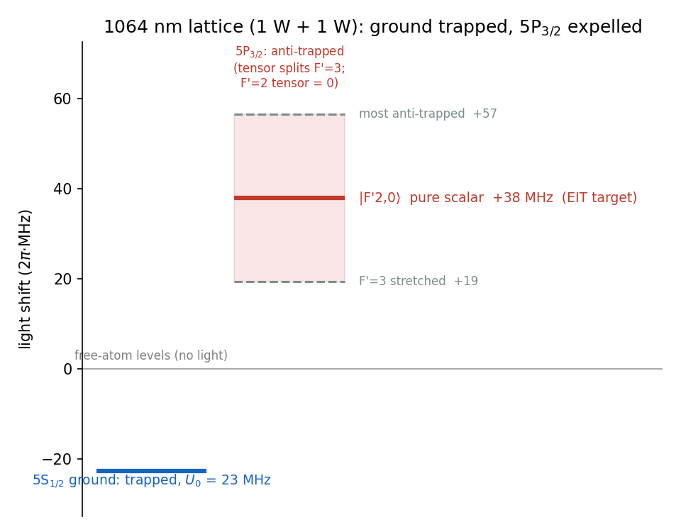
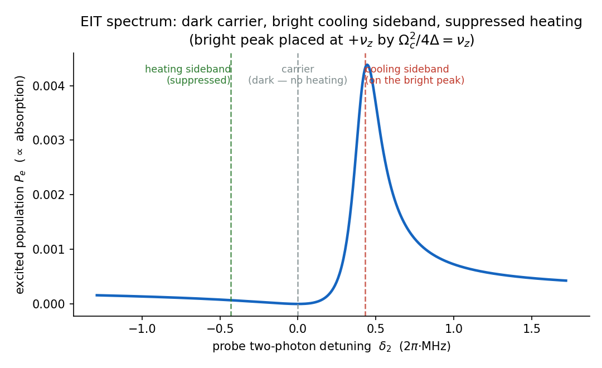
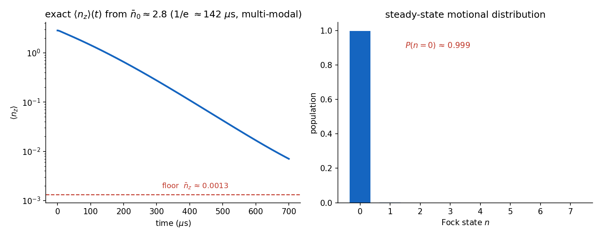
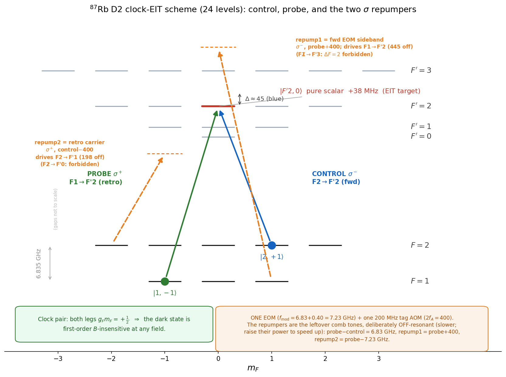

# Clock-EIT cooling — Layer 1: one atom at the trap centre

The physics core of the scheme, reduced to the case you can check by hand and with one short script:
**a single ⁸⁷Rb atom at the centre of the 1064 nm trap, cooled on its axial motion.** Sections 1–5 are the
clean 3-level core you can check by hand; **section 6** puts back the full ⁸⁷Rb manifold and the *real*
single-EOM delivery (the repumpers); the cloud — atoms off-axis — is the one piece left for later (section 7).

**The EIT mechanism floor:** one atom on axis, ideal Λ, reaches **n̄_z ≈ 0.0013** — about **99.9 % axial
ground state**. The hand formula gives (Γ/4Δ)² ≈ 0.0011; `cooling.py` gives 0.0013; the full multilevel
solver gives 0.0032 (the same number with photon recoil put back). That is what the *cooling* can do; what
the *real delivery* then costs — chiefly the off-resonant repumping — is section 6.

Frequencies are angular, in 2π·MHz. All numbers live in [`config.py`](config.py); the figures below are
regenerated by [`python plots.py`](plots.py).

---

## 1. The 1064 nm trap, and why the excited state is expelled

Two 1064 nm beams, **1 W each, counter-propagating**, make the lattice. The AC light shift of a level of
polarizability α in intensity I is

$$U = -\frac{\alpha\,I}{2\varepsilon_0 c}\,,$$

so α > 0 is pulled **down** (trapped) and α < 0 is pushed **up**. At a lattice antinode the two fields add,
so the intensity is 4× the single-beam peak 2P/πw₀²; for 1 W and w₀ = 19 µm that is I = 7.0×10⁹ W/m².

- **Ground 5S₁/₂**, α₀ = +687 a.u. → pulled down by **U₀ ≈ 22.8 MHz = 1.09 mK**. That is the trap depth;
  from it follow ν_z = 2π·430 kHz and η = 0.094.
- **Excited 5P₃/₂**, α₀ = −1149 a.u. (Chen–Raithel, PRA 92, 060501(R), 2015) — *negative* — so it is pushed
  **up** by 22.8 × (1149/687) ≈ **+38 MHz**. The excited state is **anti-trapped** at 1064 nm.

The tensor polarizability (α₂ = +563 a.u.) splits the excited manifold by m′ — with one clean exception
that the whole scheme leans on:

> The cooling transition's upper state **|F′=2, m′=0⟩ is pure scalar**: the Wigner 6j {2 2 2; 3/2 3/2 3/2}
> = 0 kills the entire F′=2 hyperfine tensor. So |F′2,0⟩ sits at **+38 MHz independent of polarization
> geometry** — a fixed, calculable shift, not a sublevel that wanders with the trap. (The F′=3 levels *do*
> split: +19 MHz for the stretched |3,±3⟩ up to +57 MHz.)



*The 1064 nm light shifts, every number from [`stark.py`](stark.py). The ground state is pulled down into a
23 MHz (1.1 mK) well; the whole 5P₃/₂ manifold is pushed up (anti-trapped), the tensor splitting the F′=3 band
from +19 to +57 MHz. The EIT target |F′2,0⟩ sits at the pure-scalar +38 MHz — fixed by the 6j-null, the same
in any polarization geometry.*

The whole thing is closed-form arithmetic — run [`python stark.py`](stark.py) to get every number above. The
practical consequences: "Δ = +45 MHz" is measured from the *in-trap* |F′2,0⟩, and the brief excursions onto
the anti-trapped excited state during cooling cost a little heating — the once-only "squeezer" term in Layer 2.

---

## 2. The Λ scheme

A Λ on the D2 line, both legs to **one** excited state:

```
                         |e> = |F'=2, m'=0>          (anti-trapped, +38 MHz; pure scalar)
                          /\
            probe σ⁺    /    \    control σ⁻
           (weak, Ω_p)/      \(strong, Ω_c)
                      /        \
   |g1> = |F=1, m=-1>          |g2> = |F=2, m=+1>
```

Both legs are blue-detuned by Δ = +45 MHz; the two-photon detuning δ₂ = (probe − control) is servoed to
zero. Both ground states have g_F·m_F = +½, so the dark state is **first-order field-insensitive** — the
"clock" property, and the reason for this exact pair. Here we take the pair as given and ask only: how low
does it cool?

---

## 3. How EIT cools

At two-photon resonance the atom falls into a **dark state** Ω_c|g1⟩ − Ω_p|g2⟩ that doesn't absorb. Scan
the probe and the absorption is **zero at δ₂ = 0** (the dark resonance) with a **narrow bright peak**
displaced by the control's AC-Stark shift Ω_c²/4Δ.

Add the motion: a trapped atom absorbs on sidebands at ±ν_z (red removes a phonon = cooling, blue adds one
= heating). EIT cools by lining the spectrum up so that

- the **carrier** sits on the dark resonance → no scattering, no carrier heating;
- the **cooling (red) sideband** sits on the bright peak → strong absorption;
- the **heating (blue) sideband** sits in the transparency window → suppressed.

Crucially this needs no resolved sideband (here ν_z/Γ ≈ 0.07): the *narrow EIT feature*, not the natural
linewidth, gives the selectivity. That is the whole point of EIT cooling.



*Absorption (excited population) vs the two-photon detuning δ₂. Zero at the carrier (δ₂ = 0, the dark
resonance), a narrow bright peak parked on the cooling sideband at +ν_z, and the heating sideband at −ν_z left
in the transparency window — exactly the alignment that cools. Computed by [`plots.py`](plots.py).*

---

## 4. The resonance condition, and the floor

The bright peak lands on the cooling sideband when its AC-Stark displacement equals the trap frequency:

$$\frac{\Omega_c^2}{4\Delta} = \nu_z \;\Rightarrow\; \Omega_c = \sqrt{4\,\Delta\,\nu_z} \approx 8.8 \text{ (2π·MHz)},$$

with the probe kept weak (Ω_p = 0.12 Ω_c). The motion then obeys a rate balance — cooling rate A₋, heating
rate A₊ — with steady state n̄_z = A₊ / (A₋ − A₊). With the cooling sideband on the bright peak, the leftover
heating is the natural-linewidth tail reaching back to the carrier, which scales as (Γ/4Δ)². So

$$\boxed{\;\bar n_{\min} \approx \left(\frac{\Gamma}{4\Delta}\right)^2 = \left(\frac{6.07}{180}\right)^2 \approx 0.0011\;}$$

— check it on a calculator. More detuning ⇒ lower floor, until photon recoil (~η² per scatter) takes over.
That one formula is the supervisable heart of Layer 1.

---

## 5. The number ([`cooling.py`](cooling.py))

The exact steady state of the driven Λ dressed by the oscillator has no clean closed form, so **this is the
one place we use code** — a 60-line `qutip` master equation (3 levels ⊗ oscillator), scanned over the servo
detuning δ₂:

```
numeric floor   <n_z> = 0.0013   at delta2 = +0.000 (servo point)
analytic floor  (Gamma/4Delta)^2 = 0.0011
ground-state population P(n=0) ~ 0.999
```

0.0013 sits just above the formula's 0.0011, and just below the full multilevel solver's clean-Λ **0.0032**
(§6) — the gap is the photon recoil this 3-level model leaves out. Run: `pip install numpy qutip && python
cooling.py` (< 10 s).



*Left: starting hot (n̄₀ = 5), the axial motion cools exponentially to the floor in τ ≈ 0.2 ms — the same
steady state, reached as a rate (the slowest Liouvillian mode). Right: at steady state essentially all the
population is in the motional ground state, P(n=0) ≈ 0.999. From [`plots.py`](plots.py).*

---

## 6. The real manifold and the delivery ([`cooling_multilevel.py`](cooling_multilevel.py))

The clean 3-level Λ idealises two things. `cooling_multilevel.py` puts them back — the full ⁸⁷Rb D2 manifold
(8 ground sublevels + the 5P₃/₂ levels), real Clebsch–Gordan couplings and photon recoil, with the atomic
core ported from the project's validated engine. The CG / line-strength conventions are checked against the
known D2 branching (5/6, 1/6, …) and the 1:5:14 line-strength ratio by [`cg_validate.py`](cg_validate.py). The tones are made and delivered by the finalised chain

```
EBLANA (1560) → EOM → EDFA → PPLN (SHG 780) → HCPCF (trap + delivery) → AOM (tag, ×2 pass) → retro
```

a **single seed and one EOM**: `f_mod = A_HFS + 2f_A = 6.83 + 0.40 = 7.23 GHz`, with a 200 MHz tag AOM
double-passed to `2f_A = 400 MHz`.



*The full D2 manifold and the four tones. control σ⁻ and probe σ⁺ form the Λ to the pure-scalar |F′2,0⟩.
The two repumpers are not separate lasers — they are the **leftover comb tones**: the forward +1 EOM
sideband (σ⁻, F=1, at **probe + 400 MHz**) and the retro carrier (σ⁺, F=2, at **control − 400 MHz =
probe − 7.23 GHz**), both deliberately off-resonant. Their nearest **allowed** lines are F′2 (445 MHz, repump1)
and F′1 (198 MHz, repump2); the closer F′3 / F′0 are ΔF=±2 dipole-forbidden, so they don't couple at all.
From [`plots.py`](plots.py).*

**(i) Manifold + recoil.** With every m-sublevel, the full recoil (both legs + emission) and the per-(F′,m′)
1064 Stark ([`stark.py`](stark.py), validated by [`stark_validate.py`](stark_validate.py)), the clean-Λ floor
is **0.0032** — the project's "realized" value, just above the recoil-light 0.0013 of §5 (the difference *is*
the recoil the 3-level model dropped). The EIT mechanism and the (Γ/4Δ)² scaling are untouched.

**(ii) Repumping is essential — and it is the real cost.** Spontaneous decay from F′ spreads population
across both ground hyperfines into sublevels the Λ never addresses; with the repumpers off, the atom pumps
**100 % dark and cooling stops**. The comb-tone repumpers — modelled as the rigorous **incoherent** off-resonant
scattering (the virtual F′ adiabatically eliminated; frame-consistent at any power) — do clear it, but only
partly: at the chain's natural power the on-axis floor settles at **≈ 0.10** (≈ 39 % of the population still in
uncooled dark sublevels) — ~30× the ideal 0.0032. **For this minimal chain the repumping, not the EIT
mechanism, is the limit.**

**(iii) Why the detunings are large — and why one EOM can't do better.** The repumper detunings are *fixed* by
f_mod and the tag shift 2f_A, and *one* AOM moves repump1 (F=1) and repump2 (F=2) in **opposite** directions, so
you cannot pull both onto a useful line. Worse, every leftover tone lives near the **cooling F′2 manifold**, and
a tone close to F′2 scatters the EIT dark state — repump1 drives |1,−1⟩→|F′2,−2⟩, repump2 drives |2,+1⟩→|F′2,+2⟩
— at a rate Γ(Ω/2)²/δ² that **equals the cooling rate at δ ≈ 200 MHz off F′2**. So the repumpers *must* sit
≳200 MHz off F′2 or they destroy the cooling: the large detunings are that protection. A configuration sweep
([`explore_configs.py`](explore_configs.py)) confirms the current choice is the best of them:

| config | EOM / AOM | repumper placement | floor |
|---|---|---|---|
| **A (current)** | f_mod 7.23 GHz, 2f_A=400, down | far off F′2 (355/445) — *safe* | **0.105** |
| B | f_mod 6.43 GHz, 2f_A=400, up | onto F′0/F′3 (decay-back, heat) | 0.45 |
| C | f_mod 6.53 GHz, 2f_A=300, up | hard onto F′0/F′3 | 1.39 |
| D | f_mod 7.04 GHz, 2f_A=202, down | repump2 *on* F′1 (157 off F′2) | 0.24 |

Every move that *lowers* a detuning makes it worse — toward F′0/F′3 you hit the decay-back lines (heat, no
inter-F repump); toward F′2 (small 2f_A) you scatter the dark state and kill the EIT. **So the single-EOM chain
is capped near ~0.1**, and its "high" detunings are optimal, not an oversight. The way below it is a *separate*
manifold — repumpers **on F′1** (resonant repump, only weakly touching F′2) — which needs a dedicated repumper
AOM + the master laser (the fuller scheme, §7, → ~0.005). *(The F′=1 second dark state — the cooling beams'
own off-resonant leak to |F′1,0⟩ — is the first deferred refinement; included here only as the leading
`with_e1` spoiler, ~+0.003, swamped by the repump floor above.)*

---

## 7. What's beyond this repo

- **Dedicated repumpers / other delivery.** The fuller project uses on-resonant repumpers and dual-end
  delivery, reaching the certified single-atom floor **~0.0048–0.0072** (≈ 0.008–0.010 all-in with the
  anti-trap squeezer). §6 shows *why* you want them: off-resonant comb-tone repumping is the bottleneck.
- **The cloud (Layer 3).** Atoms off-axis see a spread of ν_z and light shifts; the floor is then set by the
  radial temperature, removable with a flat-top trap. The hard, still-partly-open part — deliberately out of
  this single-atom repo.

The §1–5 core is the supervisable heart: the EIT mechanism and the (Γ/4Δ)² floor. §6 is the honest price of
the real delivery. If any line of physics here doesn't follow, that's a writing bug — flag it.
