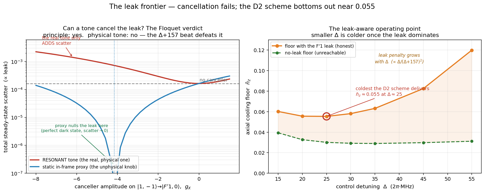

# Can the F′1 leak be cancelled? — the Floquet verdict

Chapter 04 caps the master floor at ≈ 0.06 because the EIT dark state keeps a residual coupling onto |F′1,0⟩.
**Can that coupling be cancelled?** The honest answer is **no, not by a co-propagating tone** — and the D2 scheme
bottoms out at **n̄_z ≈ 0.055**.

## 1. The question chapter 03 left open

Chapter 04 showed that *if* the dark state's coupling onto |F′1,0⟩ could be nulled, the floor would recover
toward the ≈ 0.03 no-leak ideal — but it tested this by *scaling the probe's coherent F′1 edge*, which is not
something a laser can do. A real cancellation tone is a beam at a real frequency; the only sensible one is tuned
to |1,−1⟩→|F′1,0⟩ (the F1→F′1 line), to interfere with the probe's leak onto that state. Does it cancel?

It does not, and the reason is a frequency. The control and probe close their rotating frame *exactly* (that is
why the chapter-02 solver is exact). A tone on F1→F′1 sits **Δ + 157 MHz** away in that frame, so its coupling
onto |F′1,0⟩ does not stand still — it **beats**. A static leak cannot be cancelled by an oscillating term.

## 2. The Floquet test — principle vs physical tone

[`cancellation_floquet.py`](src/cancellation_floquet.py) builds the minimal internal model (the two dark-state legs,
the two excited states, the atomic ratios) and compares two cancellers of the same amplitude g_X on
|1,−1⟩→|F′1,0⟩: a **static, in-frame** one (chapter 03's knob, made literal) and the **resonant** one (the real
F1→F′1 tone, carrying its true e^{−i(Δ+157)t} beat). Reading off the total scatter — a perfect dark state
scatters *nothing*:

- **The principle is real.** At g_X = Ω_p(R_c−R_p) the static canceller makes |D2⟩ dark on |F′1,0⟩ as well as
  |F′2,0⟩, and the scatter collapses to ~10⁻¹⁶ — a perfect dark state. Chapter 04 was right that *if* you could
  null the leak, the cold comes back.
- **The physical tone does the opposite.** At the same amplitude the real resonant tone gives ~4× the
  no-canceller scatter, and only climbs from there. The Δ+157 beat means it never lines up with the leak; it just
  dumps its own off-resonant population into |F′1,0⟩. **The only realizable single tone makes the floor worse.**

## 3. Why no single tone works

To be static in the control/probe frame, a |1,−1⟩→|F′1,0⟩ coupling must sit at the probe's own frame frequency —
i.e. be a tone *at the probe frequency*. But a σ⁺ tone on F=1 at that frequency drives |1,−1⟩→|F′1,0⟩ **and**
|1,−1⟩→|F′2,0⟩ together, locked at the atomic ratio R_p. Adding it only rescales Ω_p; it cannot move the F′1/F′2
ratio, and it is exactly that ratio (R_p ≠ R_c) that makes the leak. m-selection gives |1,−1⟩ no σ⁺ path to
|F′1,0⟩ (m′=0) that misses |F′2,0⟩ (m′=0). **The leak is structural, not a tuning failure.**

## 4. The leak-aware operating point

If the leak can't be removed, the honest task is to find where it hurts least. Scanning Δ with the leak kept
(right panel above; from [chapter 03](../03_dark_vertex/src/cooling_dark_vertex.py)'s `floor`): the leak penalty
grows monotonically with Δ — it scales as Δ/(Δ+157)² — so the usual instinct to detune harder is backwards here.
Working against it, the EIT cooling weakens as Δ → Γ. The two balance in a shallow basin at **Δ ≈ 25, where the
floor bottoms at n̄_z ≈ 0.055** (P(n=0) ≈ 95%). This refines chapter 03's ≈ 0.06 to the leak-aware optimum; it is
the coldest the clock-EIT scheme on the ⁸⁷Rb **D2** line delivers, everything folded in.

## 5. Going colder is a redesign

The leak is R_c − R_p, set by the hyperfine 6j symbols, so beating ≈ 0.055 means shrinking that difference — a
redesign, not a tweak. The two honest routes are written up separately in this appendix: a **different
transition** ([`d1_comparison.md`](d1_comparison.md) — the **D1** line, where the spoiler is 5× further off
resonance), and an **auxiliary-ground / tripod** scheme ([`options.md`](options.md), W2 — dressing a third ground
state in to supply the static coupling no co-propagating tone can). What is *not* a route: a single co-propagating
canceller (§2–3), far-detuning (§4), or squeezing the anti-trap (negligible, chapter 02's scope notes).

## Files

| file | what it does |
|---|---|
| `cancellation_floquet.py` | the minimal internal model + the Floquet test (static proxy vs the real resonant tone); prints the scatter table (needs qutip) |
| `make_figure.py` | the figure (matplotlib only; plots the solver outputs, regenerates without a solve) |

**Run:** `python src/cancellation_floquet.py` · `python src/make_figure.py`.

*Caveats: the Floquet test is an internal-level model (motion dropped) — appropriate, since the leak and its
cancellation are internal-coherence effects; the ≈ 0.055 floor of §4 is the full multilevel-plus-motion number
from chapter 03. All floors are radial-ground-state best cases and steady-state ground-band predictions — the
experiment is the arbiter.*
