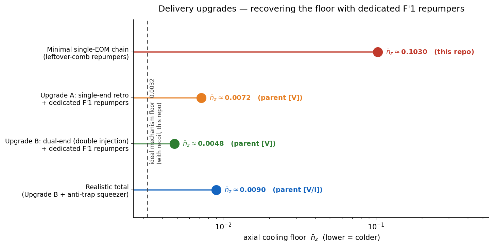
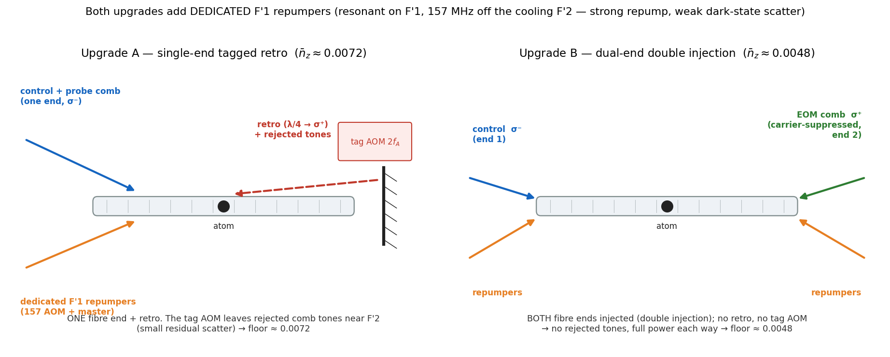

# Possible upgrades — recovering the floor with dedicated F′1 repumpers

This folder is **forward-looking**: it documents two hardware upgrades that take the on-axis floor from the
minimal single-EOM chain's repump-limited **~0.10** (what `cooling_multilevel.py` computes — see the main
README §6) down toward the EIT mechanism floor. Both work the same way: they add **dedicated F′1 repumpers**.

> **Sourcing — read this first (it matters).** The two upgrade floors below, **0.0072** and **0.0048**, are the
> parent project's *validated* numbers (`eit_cooling_tool` / `clk2`, tag `[V]`), **not** computed in
> `clock_EIT_core`. This repo computes the minimal-chain **~0.10** and the mechanism floors **0.0032 / 0.0013**.
> Reproducing the upgrades here would need a dedicated-repumper solve (a coherent F→F′1 model) — not yet done.

---

## Why a *dedicated* repumper helps (the one idea behind both upgrades)

In the minimal chain the repumpers are leftover comb tones stuck near the cooling **F′2** manifold: too close
to F′2 and they scatter the EIT dark state (kill the cooling); too far and they barely repump. That tension
caps the floor at ~0.10 (≈40 % of the population stranded in dark sublevels). See main README §6 for the full
argument.

A **dedicated repumper on F′1** breaks the tension. F′=1 is a *separate* hyperfine level of 5P₃/₂, **157 MHz
below F′2**. A tone resonant on F′1:

- repumps **resonantly** — strong and efficient;
- sits **157 MHz off the cooling F′2** — so it scatters the dark state only weakly. The ratio of useful repump
  to harmful F′2 scatter is ≈ `(157/(Γ/2))² ≈ 2700`.

F′1 is also the *only* excited level reachable from **both** ground hyperfines (F=1 and F=2) that **decays to
both** (5/6 → F=1, 1/6 → F=2) — so it clears the dark sublevels and balances F=1↔F=2. The two tones are
**repump1: F=1→F′1 (σ⁻)** and **repump2: F=2→F′1 (σ⁺)**.

This needs a *new* frequency source: the F′1↔F′2 spacing (157 MHz) is **not** a sideband of the 7.23 GHz EOM,
so the single comb cannot make it. That is the hardware the two upgrades add.

---

## The two upgrades

### Upgrade A — single-end tagged retro + dedicated repumpers → **~0.0072** [parent, V]

Keep the *single-ended* delivery (one fibre end + a retro mirror + the double-passed **tag AOM** `2f_A`), and
**add** the dedicated repumpers:

- **repump1** = F=1→F′1 (σ⁻) from a **157 MHz AOM** step off the cooling light;
- **repump2** = F=2→F′1 (σ⁺) from the **master laser** (the 780 reference, an "incoherent clean offload").

The retro tag still leaves the rejected comb tones near F′2 (a small residual dark-state scatter), so the floor
lands at **~0.0072** rather than the cleaner dual-end value.

*Hardware added vs the minimal chain:* one 157 MHz repumper AOM + the master beam into the fibre.

### Upgrade B — dual-end (double injection) + dedicated repumpers → **~0.0048** [parent, V]

Inject from **both** fibre ends (this is the "double injection"): control σ⁻ from one end, the EOM comb σ⁺
(carrier-suppressed) from the other — **dropping the retro mirror and the tag AOM entirely**. With the dedicated
repumpers as in A, this is the cleanest single-atom configuration:

- **no tag AOM → no rejected tones near F′2** (the residual scatter of A is gone);
- **full power each way** (no ~30 % retro-efficiency penalty);
- carrier-suppressed comb → a clean Λ.

Floor **~0.0048** — the lowest of the delivery options, and the project's *preferred* architecture (the
single-ended retro line is the fallback for when both-end fibre access is impractical).

*Hardware added:* optical access to **both** ends of the HCPCF, plus the dedicated repumpers.

---

## Summary

| config | repumpers | extra hardware | floor | source |
|---|---|---|---|---|
| minimal single-EOM (this repo) | leftover comb tones | — | ~0.10 | this repo |
| **Upgrade A** single-end retro | dedicated F′1 | 157 MHz AOM + master | **0.0072** | parent [V] |
| **Upgrade B** dual-end double injection | dedicated F′1 | both-end access + 157 AOM + master | **0.0048** | parent [V] |
| Upgrade B + anti-trap squeezer (all-in) | — | — | 0.008–0.010 | parent [V/I] |

The mechanism floor these chase is **0.0032** (with recoil) / 0.0013 (recoil-free), both computed in this repo.

Regenerate the figures: `python upgrade_figures.py` (matplotlib only, no solves).
