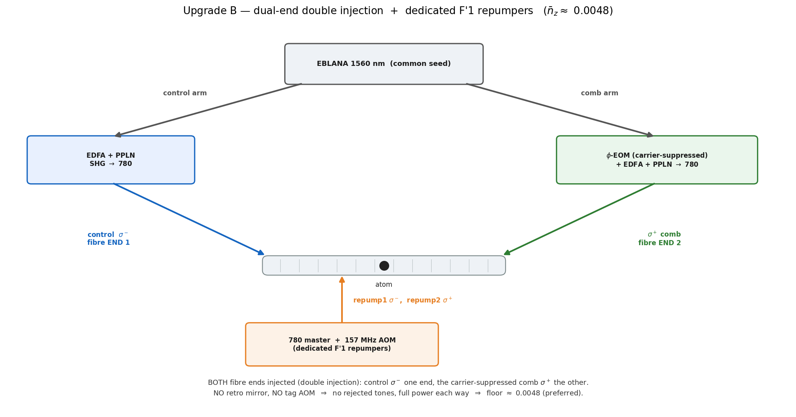

# Upgrades — recovering the floor with dedicated F′1 repumpers

This folder is **forward-looking**: it documents the hardware upgrades that take the on-axis floor from the
minimal single-EOM chain's repump-limited **~0.10** (what `02_multilevel/cooling_multilevel.py` computes — see
the main README) down toward the EIT mechanism floor. Both upgrades work the same way: they add **dedicated
F′1 repumpers**.

> **What is computed where.** The minimal-chain **~0.10** and the mechanism floors **0.0032 / 0.0013** are
> computed in this repository. The two upgrade floors below (**~0.0072** and **~0.0048**) are **design targets**
> of the fuller scheme — reproducing them would need a dedicated-repumper (coherent F→F′1) solve, which is not
> included here. They are shown so the gain from the upgrade is visible, labelled as targets, not as results.

---

## Why a *dedicated* repumper helps (the one idea behind both upgrades)

In the minimal chain the repumpers are leftover comb tones stuck near the cooling **F′2** manifold: too close
to F′2 and they scatter the EIT dark state (killing the cooling); too far and they barely repump. That tension
caps the floor at ~0.10 (≈40 % of the population stranded in dark sublevels). See the main README for the full
argument.

A **dedicated repumper on F′1** breaks the tension. F′=1 is a *separate* hyperfine level of 5P₃/₂, **157 MHz
below F′2**. A tone resonant on F′1:

- repumps **resonantly** — strong and efficient;
- sits **157 MHz off the cooling F′2** — so it scatters the dark state only weakly. The ratio of useful repump
  to harmful F′2 scatter is ≈ `(157/(Γ/2))² ≈ 2700`.

F′1 is also the *only* excited level reachable from **both** ground hyperfines (F=1 and F=2) that **decays to
both** (5/6 → F=1, 1/6 → F=2) — so it clears the dark sublevels and balances F=1↔F=2. The two tones are
**repump1: F=1→F′1 (σ⁻)** and **repump2: F=2→F′1 (σ⁺)**.

*The **atomic** scheme is identical for both upgrades: the cooling Λ (control σ⁻ / probe σ⁺ → |F′2,0⟩,
blue-detuned Δ≈+45 MHz) plus the two dedicated repumpers resonant **on F′1**, 157 MHz below the cooling F′2.
Only the **delivery** — how those tones are generated and injected — differs between the two configs (the
optical benches below).*

### Sourcing the F=2 repumper, without a new lock

The F=2 leg (**repump2: F=2→F′1, σ⁺**) is the one that clears the populous F=2 dark sublevels, and it is easy to
make robustly. Take a CW slave locked to the ⁸⁷Rb **cooler** (F=2→F′3) and shift it down by **≈363 MHz** — a
standard **double-pass ~181 MHz AOM**. That offset is the F′3→F′1 hyperfine spacing (−424 MHz) plus the
in-trap 1064 light shift (+61 MHz); it is **pure ⁸⁷Rb atomic physics**, so it does not depend on where any
reference laser happens to be locked. (It must be F′1, not the closer F′2: a σ⁺ tone resonant on F′2 would
drive the bright leg |2,+1⟩→|F′2,+2⟩ and spoil the cooling. F′1 has no m′=+2, so the bright leg is spared.)

**One residual.** A σ⁺ repumper on F′1 cannot reach **|2,+2⟩** (that would need |F′1,+3⟩, which does not exist).
|2,+2⟩ fills slowly from the repumper's own decay and is emptied only slowly by the control beam. It is a small
effect, but if the measured floor sits above target it is the next lever — a weak π or σ⁻ clean-up tone on
|2,+2⟩, not a change to the repumper AOM.

---

## The two upgrades

The two configs share the atomic scheme above; they differ only in the **optical bench** — shown for each below.

### Upgrade A — single-end tagged retro + dedicated repumpers → **~0.0072** (design target)

Keep the *single-ended* delivery (one fibre end + a retro mirror + the double-passed **tag AOM** `2f_A`), and
**add** the dedicated repumpers. The retro tag still leaves the rejected comb tones near F′2 (a small residual
dark-state scatter), so the floor lands at **~0.0072** rather than the cleaner dual-end value.

*Hardware added vs the minimal chain:* the dedicated-repumper sources (above) injected into the fibre.

### Upgrade B — dual-end (double injection) + dedicated repumpers → **~0.0048** (design target)

Inject from **both** fibre ends (the "double injection"): control σ⁻ from one end, the EOM comb σ⁺
(carrier-suppressed) from the other — **dropping the retro mirror and the tag AOM entirely**. With the dedicated
repumpers as in A, this is the cleanest single-atom configuration:

- **no tag AOM → no rejected tones near F′2** (the residual scatter of A is gone);
- **full power each way** (no ~30 % retro-efficiency penalty);
- carrier-suppressed comb → a clean Λ.

Floor **~0.0048** — the lowest of the delivery options. The single-ended retro line (A) is the fallback for when
both-end fibre access is impractical.

*Hardware added:* optical access to **both** ends of the HCPCF, plus the dedicated repumpers.

---

## Summary

| config | repumpers | floor | provenance |
|---|---|---|---|
| minimal single-EOM (baseline) | leftover comb tones | ~0.10 | computed here |
| **Upgrade A** single-end retro | dedicated F′1 | **~0.0072** | design target |
| **Upgrade B** dual-end double injection | dedicated F′1 | **~0.0048** | design target |
| Upgrade B + anti-trap squeezer (all-in) | — | ~0.008–0.010 | design target |

The mechanism floor these chase is **0.0032** (with recoil) / 0.0013 (recoil-free), both computed in this repo.

Regenerate the figures: `python upgrade_figures.py` (matplotlib only, no solves).
