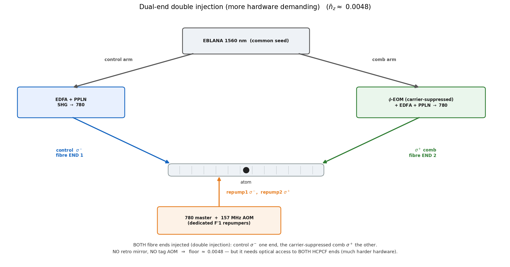

# More hardware-demanding schemes (curiosities)

These are recorded **for completeness only**. They reach a slightly lower floor than the
[master upgrade](../README.md), but at a hardware cost that is not worth paying for a single atom — they are
**curiosities, not the realistic path**. The realistic upgrade is the master one (dedicated F′1 repumper on the
existing single-end chain, → ~0.0072); start there.

## Dual-end double injection → ~0.0048 (design target)

Inject from **both** fibre ends instead of retro-reflecting from one: control σ⁻ from one end, the
carrier-suppressed EOM comb σ⁺ from the other — dropping the retro mirror and the tag AOM entirely. With the
same dedicated F′1 repumpers as the master upgrade, this removes the rejected tones near F′2 and the
~30 % retro-efficiency penalty, so the floor reaches **≈ 0.0048**.

**Why it is not the recommended path.** It needs **optical access to both ends of the HCPCF** — a much harder
build than the single-ended master upgrade — and the gain over it (0.0072 → 0.0048) is modest. Both numbers sit
near the same single-recoil scale, well below anything the experiment is currently limited by.

## Anti-trap squeezer (all-in ≈ 0.008–0.010, design target)

A trap-side refinement (not a delivery change): a brief "squeeze" that cancels the once-per-cycle heating from
the anti-trapped excited state. It is folded into the realistic *all-in* total on the floor ladder in the
[master-upgrade README](../README.md); listed here as the other piece beyond the baseline.

---

*All numbers here are **design targets**, not computed in this repository (that would need a dedicated-repumper /
delivery solve). The mechanism floor they chase, **0.0032**, is computed in [`../../02_multilevel/`](../../02_multilevel/).
The figure is regenerated by [`../upgrade_figures.py`](../upgrade_figures.py) (it writes `bench_dual_end.png`
into this folder).*
